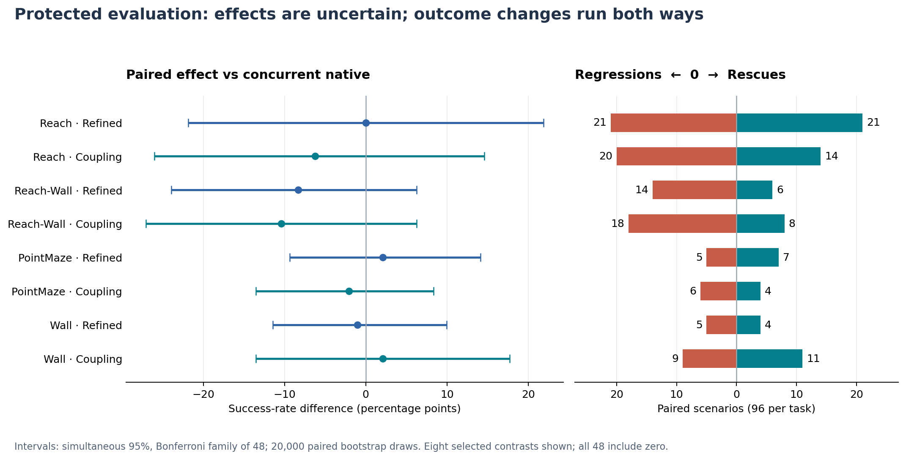
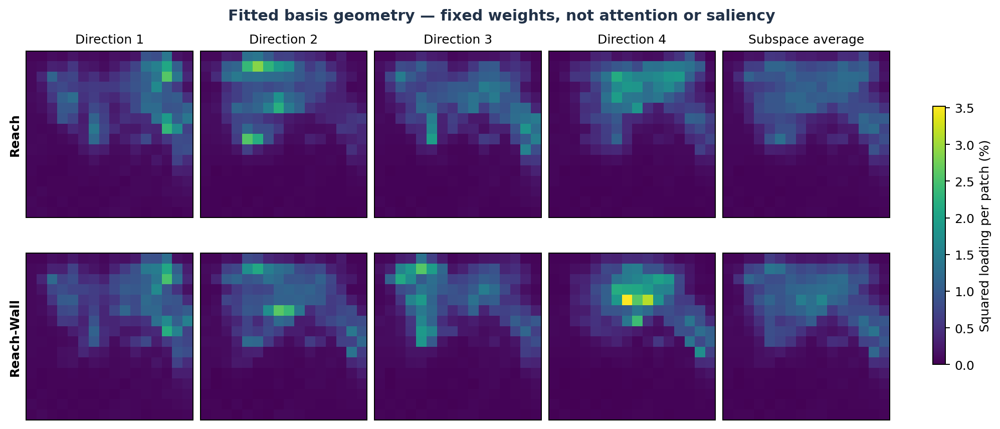

# JEPA-WM: Do Better Forecasts Make Better Plans?

Activation steering inside a **frozen world-model predictor**, evaluated from offline
forecast error through closed-loop robot planning. Built with Python and PyTorch on
the [JEPA-WM](https://github.com/facebookresearch/jepa-wms) implementation.

[Methods & ablations](docs/METHODS.md) · [Results & limitations](docs/RESULTS.md) ·
[Reproduce](docs/REPRODUCING.md) · [GPU execution](docs/COMPUTE.md)

## Three findings

### 1. A single four-direction edit improves offline forecasts

The refined intervention reduced H6 proprioceptive embedding prediction error by
**2.36% on Reach and 2.19% on Reach-Wall** in the primary BF16 development evaluation
(33 and 27 trajectories). An offline-calibrated response map applies the edit inside
one forward pass, with **zero online response probes or extra native-shadow forecasts**.
This establishes an inexpensive forecast correction, not a task-success gain.
[Estimates and intervals](paper/data/reported_contrasts.csv) · [Implementation](src/offline_study/fixed_response.py).

### 2. Low-rank corrections are spatially distributed—and use their directions unevenly

The fitted directions span image patches rather than identifying individual semantic
neurons. During the protected rollouts, the four-dimensional coefficient space had
an effective dimensionality of **1.37–3.07**, depending on the task. Low rank in
feature space does not imply spatial localization or equal use of each direction.
This is a descriptive measurement of the applied edits, not a discovered physical code.
[Basis maps](#geometry-of-the-fitted-edits) · [Coefficient audit](reports/fresh-confirmation/mechanism_audit.json).

### 3. The same aggregate score can hide different successes

On fresh Reach scenarios, native and refined planning both succeeded **52/96** times,
but the edit **rescued 21 failures and regressed on 21 successes**: outcomes changed
on **42/96 scenarios** despite an unchanged aggregate score. Paired evaluation exposes
this behavioral sensitivity that a success-rate table alone misses. Across the full
panel, these changes did not establish a reliable net improvement.
[Paired outcomes](docs/RESULTS.md#mechanistic-diagnostics).

## Architecture and ablation sites


**V** edits the predictor's visual input; **A** edits block B3's action conditioning;
**R** applies the refined rank-four correction at B3's output. Sites are shown at
imagined step H3 within an H6 forecast. B0–B5 are zero-indexed predictor blocks.
The diagram shows alternative arms, **not three edits applied together**. The frozen
encoders, model weights and CEM objective are unchanged across arms.
CEM repeats candidate proposal/scoring; simulator observations refresh at replanning.
[Exact arm definitions](docs/METHODS.md).

## Question and hypotheses

A world model predicts candidate actions' consequences; a planner chooses among
those forecasts. We tested whether latent corrections survive that decision step:

- **Forecast correction:** a low-rank activation edit reduces recorded-action prediction error.
- **Direction specificity:** fitted directions help more than similarly sized, calibrated random-subspace or random-direction edits.
- **Behavioral transfer:** corrections improve planning on new scenarios without refitting.

This is task-specific fitting, **not** source-to-unseen-task transfer.
Model weights stay frozen; fitted intervention parameters do not.

## What we ran

1. **Offline development.** Fit directions/readouts on fitting trajectories; measure
   forecast effects on separate recorded trajectories. Corrected primary sweeps
   covered 33 Reach, 27 Reach-Wall and 21 Push-T trajectories, with BF16 primary and
   FP32 sensitivity analyses. Development results informed the recipe.
2. **Behavioral development.** Evaluate released checkpoints across six tasks.
   These earlier cells are reported separately, not as fresh confirmation.
3. **Protected confirmation, completed September 13, 2026.** Freeze the eight-arm
   recipe and analysis, then evaluate 96 new scenarios each on Reach, Reach-Wall,
   PointMaze and Wall: **384 paired scenarios, 3,072 arm evaluations**. Exposure
   checks found no overlap with the fitting/development sources they audited.

### Eight paired arms

| Arm | What it tests |
|---|---|
| Unsteered | Concurrent native planner on the same fresh scenarios |
| Refined four-direction edit | Offline-calibrated response map; one predictor edit, no online response probes |
| Calibrated random subspace | Same rank/support/dose, with its own response calibration |
| Equal-budget vision–action coupling | Joint visual/action-conditioning edit at a fixed standardized-energy budget |
| Dose-matched random directions | Same intervention sites and budget, randomized directions |
| Unscaled joint | Both pathways at their original doses |
| Visual only | Remove the action-conditioning edit |
| Action-conditioning only | Remove the visual edit |

The randomized comparators are **activation edits, not random robot actions**.
The joint/visual/action/native factorial tests pathway contributions and interaction;
the equal-budget joint arm separately tests efficacy at a matched budget.

## Final protected results

Task success (%), **96 scenarios per cell**. Every arm is paired to the concurrent
native row below, not an older checkpoint evaluation on different scenarios.

| Intervention | Reach | Reach-Wall | PointMaze | Wall |
|---|---:|---:|---:|---:|
| Unsteered | 54.17 | 29.17 | 86.46 | 81.25 |
| Refined four-direction | 54.17 | 20.83 | 88.54 | 80.21 |
| Calibrated random subspace | 44.79 | 21.88 | 86.46 | 80.21 |
| Equal-budget coupling | 47.92 | 18.75 | 84.38 | 83.33 |
| Dose-matched random directions | 46.88 | 27.08 | 87.50 | 77.08 |
| Unscaled joint | 52.08 | 22.92 | 84.38 | 77.08 |
| Visual only | 54.17 | 22.92 | 81.25 | 80.21 |
| Action-conditioning only | 47.92 | 17.71 | 81.25 | 78.13 |



All **48 prespecified simultaneous 95% intervals** include zero, including comparisons
against native, randomized comparators, and pathway contrasts. We use 20,000
paired-scenario bootstrap draws with a Bonferroni family of 48. Intervals are wide:
the study neither establishes a reliable gain nor demonstrates equivalence.
[Exact estimates and intervals](reports/fresh-confirmation/report.json).

## Geometry of the fitted edits



These are **fixed basis loadings**, not attention maps, semantic neurons, or per-example
explanations. Action hashes changed, but fresh candidate costs and elite ranks
were not logged; the forecast-to-decision link remains unresolved.
Coefficient effective dimensionality uses uncentered second moments, so it includes
the mean direction. Delivered coupling energy matched its comparator; an absent edit
is not supported as a simple explanation of the behavioral results.
[Analysis details](docs/RESULTS.md#mechanistic-diagnostics).

## PyTorch GPU execution

We used the [Ultra-Scale Playbook](https://huggingface.co/spaces/nanotron/ultrascale-playbook)
and [JAX Scaling Book](https://jax-ml.github.io/scaling-book/gpus/) as systems references,
**without porting to JAX or doing distributed training**:

- Independent scenario jobs on model replicas; all eight paired arms stay on one physical GPU.
- Batch the planner's **300 candidate trajectories** inside each forecast; preserve the planning budget.
- Stage inputs/checkpoints on worker disks; archive completed records to GCS alongside computation.
- Verify receiving-device behavior, input/source hashes and completed records before collection.
- Account for setup, simulator work, stragglers and transfers; GPU count alone is not throughput.

The model fits on one GPU. No gradient all-reduce, ZeRO/FSDP, tensor/pipeline
parallelism, new FlashAttention implementation or custom CUDA kernels were added
for this campaign. Protected runs retained strict FP32 with TF32 disabled.
We do not claim measured scaling efficiency or a kernel speedup.
[Code and trade-offs](docs/COMPUTE.md).

## Reproduce

```bash
python -m venv .venv
source .venv/bin/activate
python -m pip install -e '.[analysis]'
python scripts/build_readme_figures.py
python scripts/check_public_results.py
python -m unittest discover -s tests -p 'test_fresh_confirmation.py' -v
```

Figures and summary checks run on CPU from committed aggregates. Raw-result replay
requires archived per-scenario records; model execution also requires pinned upstream
code, simulator dependencies, checkpoints and input banks. **Bulk assets are not
bundled or publicly downloadable from this repo.**
[Hashes, access limits and replay instructions](docs/REPRODUCING.md).

## Scope

One released checkpoint per task; Reach and Reach-Wall share the MetaWorld checkpoint.
No independent-training-seed replication, no no-refit held-out-task experiment,
and no fresh Push-T or DROID confirmation. DROID's earlier recorded-plan score is
not physical-robot success. This is an independent case study, not the authors'
official implementation or a reproduction of their multi-seed training results.

`src/` contains interventions/evaluation; `analysis/mechanism/` contains diagnostics;
`tests/` contains CPU and integration checks; `reports/` and `paper/data/` retain
scientific evidence. Dated development reports are historical, not competing final
results. Operational logs, billing records, working drafts and bulk archives are
excluded from the tracked tree.
