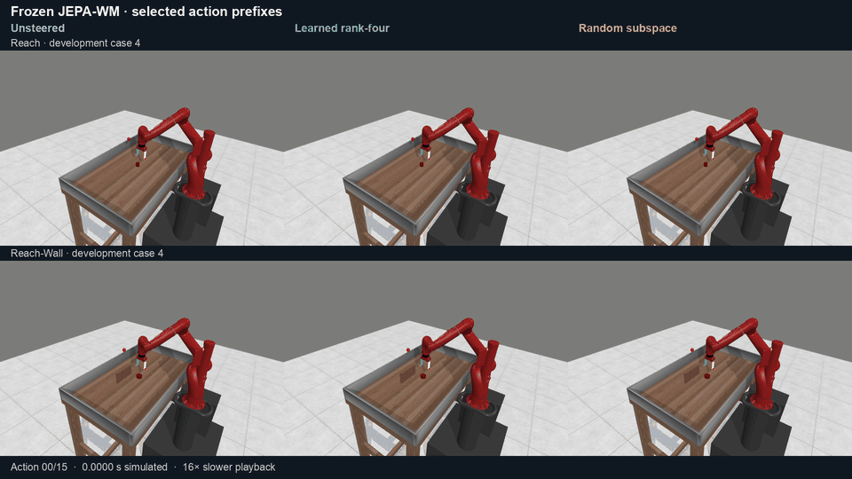

# Activation Steering in JEPA World Models

We study **activation steering and representational geometry in frozen JEPA-WM
checkpoints**. We compare low-rank predictor corrections, visual and
action-conditioning edits, and matched random controls, with layer sweeps and
component ablations. The question is how the geometry of an edit affects future
predictions, candidate rankings, and the plans ultimately executed.

Sonia Joseph et al.'s [*Interpreting Physics in Video World Models*](https://arxiv.org/html/2602.07050v1)
provides an important reference: their **Physics Emergence Zone** analysis connects
layerwise access to physical variables with distributed subspaces and targeted
interventions. Here we investigate the action-conditioned JEPA-WM predictor.
We test whether low-rank corrections and local interpolation provide useful
steering directions, where their effects are strongest, and how those effects
propagate through a sampling planner.

**Key results:** the rank-four edit reduces H6 proprioceptive forecast MSE by
**2.36% / 2.19%** on Reach / Reach-Wall. A score-margin bound certifies an unchanged
winner in **184/192 fixed candidate banks**, while later adaptive searches can
return different plans. Local reconstruction reverses between FP32 and BF16.
The separate **3,072-run protected evaluation** establishes no reliable success
gain; the experiments below distinguish these endpoints.

[Paper](paper/workshop/main.pdf) · [Methods](docs/METHODS.md) · [All results](docs/RESULTS.md) · [Reproduce](docs/REPRODUCING.md)

## Model and interventions

We keep the encoders, six-block predictor, and planning objective fixed.
Interventions enter at imagined step **H3** of an **H6** forecast. CEM scores
300 candidate action sequences against the encoded goal, refits its proposal
from ten elites, and repeats before executing a prefix and replanning.


| Family | Intervention | Control or ablation |
|---|---|---|
| Predictor correction (R) | Learned rank-four edit at B3's output | Response-calibrated random subspace; same rank, site, and prescribed dose |
| Visual–action coupling (V+A) | Visual-input and B3 action-conditioning edits, each scaled by 1/√2 | Random directions with the same sites and dose policy |
| Component ablations | Original-dose joint visual and action edits | Visual-only and action-only |

Together with the unsteered checkpoint, these form eight arms. R and V/A are
alternative interventions. Directions and calibration are fitted on fitting
trajectories; recorded development trajectories inform the recipe. The final
four-task confirmation uses new scenarios after that recipe is frozen.
[Operator equations, fitting, and dose definitions](docs/METHODS.md).

## Simulated executions



Saved 15-action prefixes from the first registered follow-up case in each task,
replayed from the recorded simulator states. Playback is slowed 16×; these clips
show the initial execution, not full-task completion. The examples were selected
by case order. [HD video](docs/media/jepa_prefix_comparison_hd.mp4) ·
[Replay verification and reproduction](docs/media/README.md).

## How an activation edit reaches the planner

### A score-margin bound identifies stable choices

For 192 development states, we rescore the same 300 candidates under each edit.
If the range of cost changes is smaller than the original winner's lead, the
winner cannot change. This bound certifies **184/192** learned-edit comparisons;
the winning candidate actually changes in **1/192**.


The horizontal axis is the cost-change range divided by the original winning
margin. Values below one certify an unchanged winner. This connects edit size
to a specific decision boundary, while leaving later CEM updates unconstrained.
[Derivation and all four edit arms](docs/MECHANISMS.md).

### Adaptive search produces different plans

In a separate 56-context extension, both learned and random edits change later
CEM proposals and the returned action prefixes. All fifteen iterations and
paired prefix endpoints are retained. The six registered learned-versus-random
intervals include zero: the demonstrated effect is search sensitivity, without
an established advantage for learned edits. [Search curves](docs/figures/cem_expansion_search.png)
· [All paired prefixes and inference](docs/CEM_EXPANSION.md).

## Layer structure and forecast correction

An earlier rank-one sweep measures every predictor block, both visual and
proprioceptive forecasts, six horizons, and FP32/BF16 execution. Early-block edits
produce larger H6 proprioceptive corrections on Reach and Reach-Wall in both
precisions. Push-T has a different response, so the layer pattern is task-dependent.


Cells show MSE reduction as a percentage of unsteered error; positive is better.
H1–H2 precede the H3 intervention. Visual and proprioceptive panels use separate
color scales. The B2+B3 and all-six rows retain the multi-block controls.
[All 576 cells, FP32, and random comparisons](docs/MECHANISMS.md#layer-response-map).

The later **rank-four B3 correction** reduces H6 proprioceptive MSE by **2.36%
on Reach and 2.19% on Reach-Wall**. This operator is fitted separately from the
rank-one sweep; the sweep does not establish where to place the rank-four edit.

## Additional geometry and mechanism analyses

<details>
<summary>Shared corrections, action history, numerical precision, and attention maps</summary>

### Shared corrections can change relative goal costs

In a 64-context replay, the component shared across candidates reconstructs the
full edit's candidate-centered cost changes with scores of **0.983 / 0.998** on
Reach / Reach-Wall. A shared activation shift can affect rankings because its
contribution to squared goal distance depends on each candidate's prediction.
Random-subspace edits show a similar pattern. Components retain their original
magnitudes, so this is a decomposition of the delivered edit, not an equal-energy
comparison of steering directions. [Component replay](docs/PILOT_MECHANISMS.md).

### Consistent action patches must include both context windows

The H3 action appears as the newest action at H3 and as history at H4.
Patching both appearances across all six blocks reproduces the raw input-action
counterfactual exactly through H6. A one-time patch diverges when the original
action returns as history. This 16-context, two-bank experiment distinguishes a
coherent action substitution from a local condition edit.
[Timing figure, full layer map, and range controls](docs/ACTION_COUNTERFACTUAL.md).

### Local reconstruction depends on numerical precision

We test the geometry of the predictor's response along fixed action perturbations.
With the same weights, inputs, and interpolation coefficients, **FP32 favors cubic
reconstruction at every block, while BF16 favors linear reconstruction**.
Rounding only the FP32 outputs removes much of the cubic advantage but does not
reproduce the full BF16 result.


The 64-context control identifies sensitivity to numerical computation. The
separate five-task interpolation study finds small, mixed downstream forecast
benefits after matching requested edit doses. Local reconstruction accuracy
therefore needs its own controls and a separate test of steering utility.
[Controlled arithmetic](docs/CONTROLLED_GEOMETRY.md) · [Five-task geometry and visual–action interactions](docs/PATHWAY_GEOMETRY.md).

### Attention across layers and heads


Each cell averages H6 spatial attention distance over 32 development contexts per
task for the fixed zero-action candidate. This describes the predictor's attention
structure; identifying a causal circuit would require targeted interventions of
the kind used in Joseph et al.'s study. [All horizons and uncertainty](docs/PILOT_MECHANISMS.md).


</details>

## Physical execution and behavioral evaluation

In the **56-context physical replay**, every model forecasts every selected plan,
and each prefix executes for fifteen elementary actions from an identical reset.
The learned edit improves same-action forecast error in both tasks. All eight
physical-distance and encoded-goal-cost intervals include zero under the registered
correction. [All paired effects and the 3×3 model/plan grid](docs/PLANNED_PREFIX_REPLAY.md).

The protected evaluation covers **384 fresh scenarios × eight arms = 3,072 runs**
on Reach, Reach-Wall, PointMaze, and Wall. All 48 registered simultaneous contrast
intervals include zero, so this panel does not establish a reliable success gain.
Steering nevertheless changes which scenarios succeed: on Reach, the learned edit
rescues 21 failures and loses 21 successes, leaving both it and unsteered at 52/96.
[All arms and paired uncertainty](docs/RESULTS.md#protected-confirmation).

Development diagnostics and protected behavior use different inputs and planner
randomness. Protected runs did not save numerical candidate costs or elite ranks,
so these diagnostics cannot identify the cause of their outcome changes. Push-T
and DROID remain development-only; DROID measures recorded-action agreement.
[Completed experiments and remaining evidence gaps](docs/ANALYSIS_COMPLETION.md).

## Benchmark context

<details>
<summary>Published baselines and post hoc best-arm comparisons</summary>

### Robot success and published benchmark context

**Unsteered** means the released checkpoint with no activation edit.
**Best observed edit** means the highest success among all **seven activation-edit
arms**, including randomized comparisons. The winning edit is named in each panel;
all ties are retained. This is a **post hoc comparison**, not one fixed method.


Every ablation is eligible; Reach-Wall's winner is **randomized visual–action
coupling: 27.08%**. Error bars show episode standard errors, not uncertainty
adjusted for choosing the best arm.

These are **fresh, protected evaluation scenarios**, not the earlier development
set. That is why the unsteered Reach rate is **54.17% (52/96)** here rather than
the earlier **44.79%**. The gray published bars use different checkpoints and
evaluation populations; they provide context, not paired controls.
[Published source](https://arxiv.org/html/2512.24497v4#S5.T2) ·
[Exact values and error-bar definitions](paper/data/benchmark_comparison_sources.json).

Against concurrent unsteered JEPA-WM, these observed maxima differ by
**0.00 / −2.08 / +2.08 / +2.08 percentage points** on Reach / Reach-Wall /
PointMaze / Wall. Across the full **384 paired scenarios × eight arms = 3,072
evaluations**, we did not establish a reliable overall success improvement.
The internal effects above are findings, not a demonstrated cause of that outcome.
[Paired analysis](docs/RESULTS.md#protected-confirmation).

</details>

## Final protected results and earlier benchmarks

<details>
<summary>Full six-task table · published references, development, protected confirmation</summary>

Simulator success (%); **DROID is an action-agreement score**, not robot success.
Stages are separate populations, not interchangeable baselines. Protected cells
use 96 scenarios per arm; `—` means not run in that stage.

| Stage | Model / intervention | Reach | Reach-Wall | Push-T | PointMaze | Wall | DROID score |
|---|---|---:|---:|---:|---:|---:|---:|
| Published | DINO-WM | 44.80 | 35.10 | 66.00 | 81.60 | 64.10 | 39.40 |
| Published | JEPA-WM recipe, CEM-L2 | 58.20 | 41.60 | 70.20 | 83.90 | 78.80 | 48.20 |
| Published | JEPA-WM recipe, CEM-L1 | 55.10 | 40.80 | 63.40 | 79.70 | 46.70 | 47.20 |
| Published | JEPA-WM final, CEM-L2 | 49.00 | 29.20 | 69.40 | 83.30 | 80.90 | 46.50 |
| Development | Unsteered | 44.79 | 30.21 | 59.38 | 80.21 | 76.04 | 51.10 |
| Development | Refined four-direction | 51.04 | 31.25 | 59.38 | 85.42 | 78.13 | 51.05 |
| Development | Calibrated random subspace | 50.00 | 23.96 | 61.46 | 79.17 | 76.04 | 51.00 |
| Development | Equal-budget coupling | 48.96 | 26.04 | 61.46 | 77.08 | 82.29 | 51.07 |
| Development | Dose-matched random directions | 60.42 | 28.13 | 60.42 | 84.38 | 77.08 | 51.27 |
| Development | Unscaled joint | 52.08 | 29.17 | 61.46 | 79.17 | 78.13 | 50.85 |
| Development | Visual only | 50.00 | 38.54 | 60.42 | 81.25 | 73.96 | 50.83 |
| Development | Action-conditioning only | 42.71 | 36.46 | 58.33 | 86.46 | 76.04 | 51.11 |
| Protected | Unsteered | 54.17 | 29.17 | — | 86.46 | 81.25 | — |
| Protected | Refined four-direction | 54.17 | 20.83 | — | 88.54 | 80.21 | — |
| Protected | Calibrated random subspace | 44.79 | 21.88 | — | 86.46 | 80.21 | — |
| Protected | Equal-budget coupling | 47.92 | 18.75 | — | 84.38 | 83.33 | — |
| Protected | Dose-matched random directions | 46.88 | 27.08 | — | 87.50 | 77.08 | — |
| Protected | Unscaled joint | 52.08 | 22.92 | — | 84.38 | 77.08 | — |
| Protected | Visual only | 54.17 | 22.92 | — | 81.25 | 80.21 | — |
| Protected | Action-conditioning only | 47.92 | 17.71 | — | 81.25 | 78.13 | — |

Published rows use the authors' checkpoints and aggregation, not our paired inputs.
Development MetaWorld joint/visual/action arms use their concurrent unsteered
**45.83 / 29.17** in contrasts; the canonical development row remains unchanged.
Protected contrasts use **only the protected unsteered row**. No historical rates
are substituted for fresh baselines. [Provenance](paper/data/benchmark_comparison_sources.json).

</details>

## What this contributes

The study connects activation geometry to measurable changes in prediction,
relative goal scores, and adaptive planning. The margin bound identifies when an
edit cannot change a fixed choice; component, history, and precision controls help
interpret the edit itself. These are mechanisms within the tested computations,
with behavioral utility assessed separately.
[Relation to Physics Emergence Zone, COAST, and Manifold Steering](docs/LITERATURE_MECHANISMS.md).

## Reproduce and inspect

```bash
python -m venv .venv
source .venv/bin/activate
python -m pip install -e '.[analysis]'
python scripts/check_public_results.py
python scripts/check_manuscript.py
python scripts/build_publication_figures.py
```

These checks and figure builds run on CPU from committed aggregates. Full model
replay needs the pinned upstream code, licensed inputs, checkpoints and archived
records; bulk assets are not bundled or publicly downloadable from this repo.
[Complete reproduction instructions](docs/REPRODUCING.md).

`src/` implements interventions and evaluation; `analysis/mechanism/` contains
diagnostics; `tests/` checks them; `paper/data/` and `reports/` preserve the evidence.
Operational logs and bulk assets are excluded. No independent training-seed
replication was performed. This is an independent study, not the authors' official implementation.
