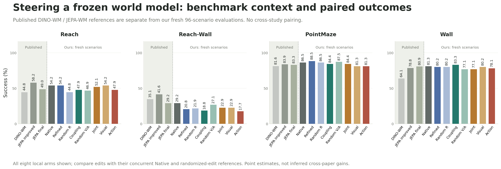
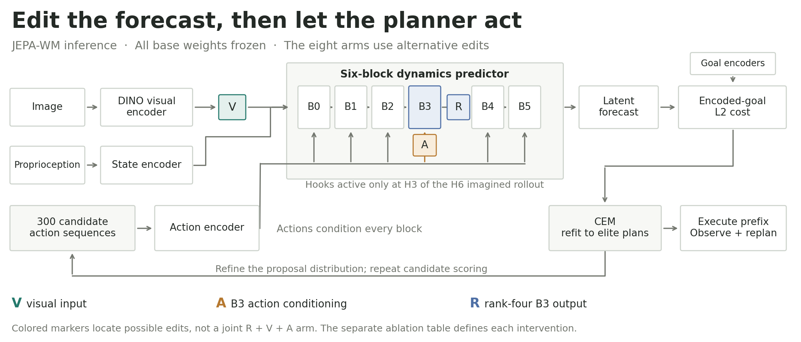
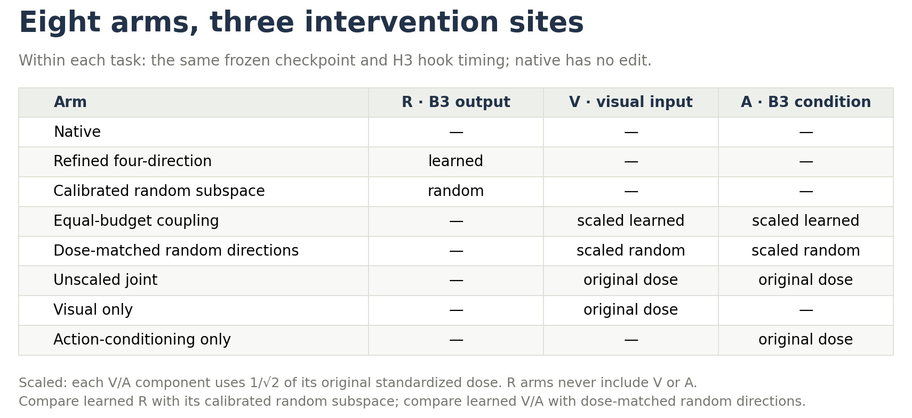
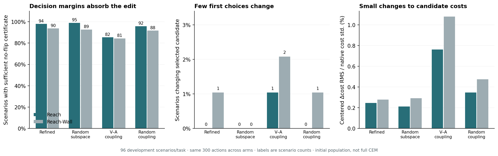
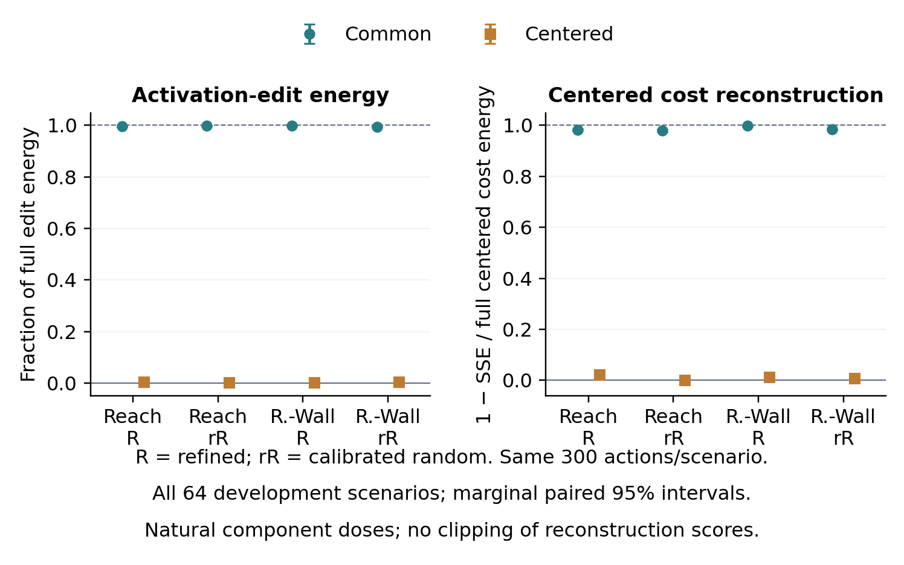
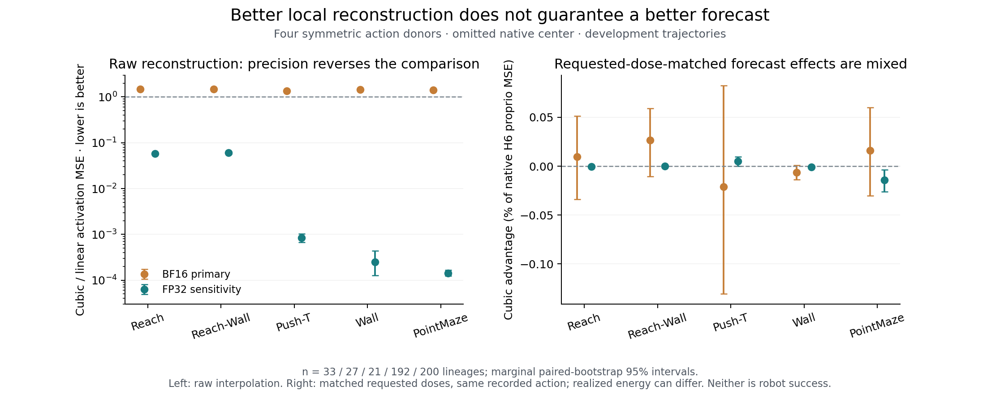

# Steering Latent World Predictions

**From internal geometry to planner decisions in a frozen JEPA-WM.**
We fit small activation edits without retraining the world model, then follow their
effects through recorded-action forecasts, candidate scoring and robot behavior.
The question is not only whether a latent prediction can be steered, but **which
corrections survive the planner's choice among imagined futures**.

[Paper](paper/workshop/main.pdf) · [Mechanisms](docs/MECHANISMS.md) · [Methods & ablations](docs/METHODS.md) · [Results](docs/RESULTS.md) ·
[Reproduce](docs/REPRODUCING.md) · [GPU execution](docs/COMPUTE.md)

## The finding: shared latent edits can redirect adaptive planning

Four-direction edits reduce development forecast error by **2.36% on Reach and
2.19% on Reach-Wall**. A new component replay shows that their **candidate-common
latent shift carries nearly all of the measured relative-score change**. A separate
eight-scenario CEM experiment preserves all ten initial elites, yet changes the
returned action prefixes after iterative search. An unchanged first selection is
not an unchanged final plan—and a changed plan is not necessarily a better one.

The contribution is a measured path from **activation geometry → goal costs →
adaptive search**, with protected robot outcomes reported separately.



Author-reported bars are context, **not paired controls**: they use different
checkpoints, aggregation and scenarios. Our edits are compared to the concurrent
unsteered row within each cohort. [Full six-task, three-stage comparison](docs/figures/benchmark_comparison.png)
keeps the earlier development table separate from protected confirmation.

### Three pieces of evidence

1. **Depth matters.** In the registered rank-one sweep, Reach H6 forecast-error
   reduction falls from **3.03% at B0 to 0.48% at B5**. Reach-Wall shows the same
   early-to-late gradient, and both persist in FP32. Push-T does not reproduce the
   MetaWorld benefit. This maps intervention susceptibility, not a universal physics layer.
2. **A shared edit can distinguish plans.** On 32 development contexts per task,
   common-only replay reconstructs the full edit's candidate-centered cost change
   with scores **0.983 / 0.998** on Reach / Reach-Wall. Random-subspace edits show
   the same pattern. Small variation across candidates does not imply irrelevance
   to goal-relative scoring; component energies were not equalized.
3. **Adaptive search can diverge after an identical first selection.** In the
   separate eight-context follow-up, every arm retains the same initial **10/10
   elites**. Later proposal updates produce different returned action prefixes.
   This is direct planner instrumentation, not evidence of improved physical control.

## Architecture and ablation sites



**V** edits the predictor's visual input; **A** edits block B3's action conditioning;
**R** applies the refined rank-four correction at B3's output. Sites are shown at
imagined step H3 within an H6 forecast. B0–B5 are zero-indexed predictor blocks.
The diagram shows alternative arms, **not three edits applied together**. The frozen
encoders, model weights and CEM objective are unchanged across arms.
CEM repeats candidate proposal/scoring; simulator observations refresh at replanning.
[Exact arm definitions](docs/METHODS.md).



## Layer-by-layer intervention map


These are **measured intervention effects, not attention weights**. Each row edits
one registered layer support at H3; each column measures a later forecast endpoint.
H1–H2 remain unchanged. The heatmap reaggregates saved lineage metrics and includes
all six blocks, B2+B3 and all-block support—without selecting a favorable layer.
Total rank and requested energy are held fixed; BF16 rounding can affect delivered dose.

The B0–B5 gradient is supported by the original paired layer contrasts. It does not
prove that B0 contains a unique physical concept: layer-specific fitting and downstream
computation are alternative explanations. This earlier rank-one sweep is separate from
the later fixed-response rank-four planner experiment.
[Matched-random map](docs/figures/layer_mechanism_bfloat16_random.png) ·
[FP32 map](docs/figures/layer_mechanism_float32_native.png) ·
[All 576 cells and analysis](docs/MECHANISMS.md#layer-response-map).

## From edited predictions to candidate choices



For native costs `C` and intervention changes `ΔC`, the selected candidate cannot
change if **`max(ΔC) − min(ΔC)` is smaller than the native best–runner-up margin**.
This is an algebraic certificate on saved scores, not a significance test. The
reanalysis verifies all 192 source records and preserves the initial 300-action
bank across arms. It explains stable choices in that diagnostic; it does not
establish the cause of outcome flips during a different, iterative rollout.
CEM can update differently even with the same best candidate if other elites change.
[Reproduce the calculation](analysis/mechanism/decision_geometry.py) ·
[Scenario-level measurements](paper/data/decision_geometry_scenarios.csv).

Across **768 raw arm records and 40,320 candidate batches**, the refined edit's
candidate-centered coefficient energy is **1.15% / 0.38%** on Reach / Reach-Wall,
versus **15.65% / 8.30%** on PointMaze / Wall. These are coefficient-space measures,
not percentages of decision-relevant information: a shared latent translation can
still change relative squared goal distances.
[Coefficient-decomposition figure](docs/figures/candidate_specificity.png) ·
[Derivation and replay test](docs/MECHANISMS.md).

### Testing the link: replay the correction, then rerun CEM



We captured each original H3/B3 correction and replayed its common and centered
components separately on **the same 300 actions**, retaining both learned and
calibrated-random arms. Cached-full and zero-edit controls reproduce the original
forecasts and scores exactly. For the learned edit, the common component contains
**99.53% / 99.78%** of field energy and gives cost-change reconstruction scores
**0.9827 / 0.9975**. Centered-only scores are **0.0218 / 0.0135**.
The reconstruction score is `1 − squared residual / squared full centered change`,
not a success probability. Components keep their natural energy, so this does not
test equal-energy centered steering. [Complete 64-case analysis](docs/PILOT_MECHANISMS.md).

In the separate **eight-context actual-CEM follow-up**—four per task—the learned
edit changes the returned 60-coordinate action prefix by mean RMS **0.503 / 0.247**
in model action coordinates; the random edit gives **0.311 / 0.112**. Both start
from the exact same candidate actions and initial elite sets as native. Later
candidate populations adapt independently, so matching later candidate IDs would
not compare the same actions. No resulting plan was executed in this diagnostic.
[All paired traces and estimates](paper/data/cem_steering_selected_prefix_summary.csv).


The entropy traces do not establish a consistent increase or decrease in search
entropy. The clearer observation is divergence of the proposal means and returned
prefixes; uncertainty about their physical quality was not measured.

### Native attention, layer by layer


The new attention map covers **six blocks × sixteen heads × six forecast horizons**
on all 64 development contexts. This H6 slice measures spatial attention distance,
not causal importance or a discovered physics-emergence zone. Attention uses the
archived zero-action candidate; the action pathway still enters through AdaLN.
[All horizons, native proposal entropy, and replay controls](docs/PILOT_MECHANISMS.md).

## Local geometry is not the same as a useful correction



On all five tasks with the geometry sweep, cubic interpolation reconstructs an
omitted activation much better than equal-anchor linear interpolation in FP32,
but worse in BF16. After normalizing edits to the same requested dose, the
corresponding H6 forecast advantage is small and mixed; realized-dose deviations
are retained in the audit. **Reconstruction fidelity
alone does not identify a useful direction for steering a future prediction.**

This is a four-anchor local test, not discovery of a dense physical manifold.
The visual/action factorial also distinguishes a true output-interaction vector
from the cross-term introduced by squared error; these are not the same mechanism.
For example, BF16 Push-T's H6 loss interaction is only **−0.049% of native MSE**:
a **+2.460%** additive cross-term and **−2.509%** nonadditive remainder nearly cancel.
This concerns the same recorded inputs, not interaction between diverging robot rollouts.
[All seven numerical/task conditions](docs/figures/paper_action_interaction.png) ·
[Audited pathway and geometry results](docs/PATHWAY_GEOMETRY.md).

## What we ran

1. **Offline development.** Fit directions/readouts on fitting trajectories; measure
   forecast effects on separate recorded trajectories. Corrected primary sweeps
   covered 33 Reach, 27 Reach-Wall and 21 Push-T trajectories, with BF16 primary and
   FP32 sensitivity analyses. Development results informed the recipe.
2. **Behavioral development.** Evaluate released checkpoints across six tasks.
   These earlier cells are reported separately, not as fresh confirmation.
3. **Protected confirmation, completed September 13, 2026.** Freeze the eight-arm
   recipe and analysis, then evaluate 96 new scenarios each on Reach, Reach-Wall,
   PointMaze and Wall: **384 paired scenarios, 3,072 arm evaluations**. Exposure
   checks found no overlap with the fitting/development sources they audited.

The randomized comparators are **activation edits, not random robot actions**.
The protected joint/visual/action/native factorial measures closed-loop behavioral
component effects and interaction. The separate recorded-input factorial measures
output nonadditivity; the equal-budget joint arm tests efficacy at a matched budget.

## Final protected results

Task success (%), **96 scenarios per cell**. Every arm is paired to the concurrent
native row below, not an older checkpoint evaluation on different scenarios.

| Intervention | Reach | Reach-Wall | PointMaze | Wall |
|---|---:|---:|---:|---:|
| Unsteered | 54.17 | 29.17 | 86.46 | 81.25 |
| Refined four-direction | 54.17 | 20.83 | 88.54 | 80.21 |
| Calibrated random subspace | 44.79 | 21.88 | 86.46 | 80.21 |
| Equal-budget coupling | 47.92 | 18.75 | 84.38 | 83.33 |
| Dose-matched random directions | 46.88 | 27.08 | 87.50 | 77.08 |
| Unscaled joint | 52.08 | 22.92 | 84.38 | 77.08 |
| Visual only | 54.17 | 22.92 | 81.25 | 80.21 |
| Action-conditioning only | 47.92 | 17.71 | 81.25 | 78.13 |

The full panel does not establish a reliable net success gain. Its mechanistic value
is in the paired changes, pathway ablations and recorded intervention behavior.
[Paired-effect figure](docs/figures/protected_results.png) ·
[Prespecified uncertainty analysis](docs/RESULTS.md#protected-confirmation) ·
[Exact estimates](reports/fresh-confirmation/report.json).

Original fresh candidate costs and elite ranks were not logged. The archived
development diagnostic and the new fixed-input attention/replay pilot are separate
measurements; they do not retrospectively recover those missing traces.
[Analysis details](docs/RESULTS.md#mechanistic-diagnostics).

## What this adds to activation-steering work

[COAST](https://arxiv.org/html/2605.17144v1) also steers latent activations, but in a
policy's action expert using success/failure labels. Our edits enter the
**predictor**, before goal scoring and candidate selection. The extra decision
step is the object of this case study—not evidence that steering cannot work in
latent world models.

The Physics Emergence Zone and Manifold Steering studies motivate internal
interventions, but their decoded-variable and local-geometry endpoints differ
from robot success. We have not identified a model-native physical coordinate
system or a causal attention circuit. [Primary-source comparison](docs/LITERATURE_MECHANISMS.md).

Next steps would compare goal-relative corrections and observed-transition
adaptation, as in [AdaJEPA](https://arxiv.org/abs/2606.32026), under matched data and
latency budgets. [LeWorldModel](https://arxiv.org/abs/2603.19312) offers a smaller
future testbed; fast weights and Memory Maze would test a separate hypothesis
about history and partial observability. None was evaluated in this study.

## PyTorch GPU execution

We used the [Ultra-Scale Playbook](https://huggingface.co/spaces/nanotron/ultrascale-playbook)
and [JAX Scaling Book](https://jax-ml.github.io/scaling-book/gpus/) as systems references,
**without porting to JAX or doing distributed training**:

- Independent scenario jobs on model replicas; all eight paired arms stay on one physical GPU.
- Batch the planner's **300 candidate trajectories** inside each forecast; preserve the planning budget.
- Stage inputs/checkpoints on worker disks; archive completed records to GCS alongside computation.
- Verify receiving-device behavior, input/source hashes and completed records before collection.
- Account for setup, simulator work, stragglers and transfers; GPU count alone is not throughput.

The model fits on one GPU. No gradient all-reduce, ZeRO/FSDP, tensor/pipeline
parallelism, new FlashAttention implementation or custom CUDA kernels were added
for this campaign. Protected runs retained strict FP32 with TF32 disabled.
We do not claim measured scaling efficiency or a kernel speedup.
[Code and trade-offs](docs/COMPUTE.md).

## Reproduce

```bash
python -m venv .venv
source .venv/bin/activate
python -m pip install -e '.[analysis]'
python scripts/build_readme_figures.py
python scripts/build_comparison_figures.py
python analysis/mechanism/steering_specificity.py
python -m analysis.mechanism.decision_geometry
python -m analysis.mechanism.pathway_geometry --plots-only
python scripts/check_public_results.py
python scripts/check_manuscript.py
python -m unittest discover -s tests -p 'test_fresh_confirmation.py' -v
```

Figures and summary checks run on CPU from committed aggregates. Raw-result replay
requires archived per-scenario records; model execution also requires pinned upstream
code, simulator dependencies, checkpoints and input banks. **Bulk assets are not
bundled or publicly downloadable from this repo.**
[Hashes, access limits and replay instructions](docs/REPRODUCING.md).

## Scope

One released checkpoint per task; Reach and Reach-Wall share the MetaWorld checkpoint.
No independent-training-seed replication, no no-refit held-out-task experiment,
and no fresh Push-T or DROID confirmation. DROID's earlier recorded-plan score is
not physical-robot success. This is an independent case study, not the authors'
official implementation or a reproduction of their multi-seed training results.

`src/` contains interventions/evaluation; `analysis/mechanism/` contains diagnostics;
`tests/` contains CPU and integration checks; `reports/` and `paper/data/` retain
scientific evidence. Dated development reports are historical, not competing final
results. Operational logs, billing records, working drafts and bulk archives are
excluded from the tracked tree.
