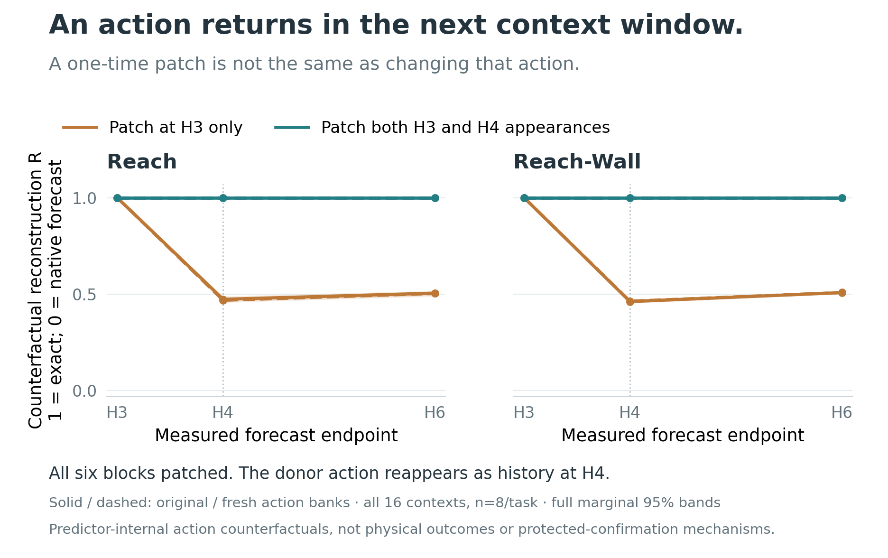

# Steering Latent World Predictions

**Small activation edits change a frozen world model's forecasts, plan scores, and adaptive search.**

We fit low-rank corrections inside JEPA-WM without retraining its weights, then
measure their effects from predicted representations through planning to robot
behavior. The central question: **when does correcting an imagined future change
the plan a robot chooses?**

[Paper](paper/workshop/main.pdf) · [Mechanisms](docs/MECHANISMS.md) · [Methods & ablations](docs/METHODS.md) · [Results](docs/RESULTS.md) ·
[Reproduce](docs/REPRODUCING.md) · [GPU execution](docs/COMPUTE.md)

## Headline results

| Finding | Measured result | Evaluation scope |
|---|---|---|
| **Improve recorded-action forecasts** | Refined four-direction edits reduce H6 proprioceptive-embedding MSE by **2.36% on Reach / 2.19% on Reach-Wall** versus native forecasts. | Offline development; these results informed the recipe. |
| **Trace a shared latent shift into plan scoring** | Common-only replay reconstructs the full edit's candidate-relative cost change with scores **0.983 / 0.998** on Reach / Reach-Wall. | **64 development contexts**, same 300 actions per context; random-subspace edits show the same pattern and component energies are not equalized. |
| **Locate an action-history dependency** | Patching an action condition at both appearances reproduces the corresponding raw-action change exactly. Patching only its first appearance gives H6 reconstruction **R = 0.503–0.508**. | **16 development contexts**, both action banks and all-block controls; a predictor-internal counterfactual, not physical accuracy. |

The contribution is an instrumented path from **activation geometry → goal costs →
adaptive search**, alongside a separate behavioral evaluation: **384 fresh paired
scenarios × eight arms = 3,072 arm evaluations across four tasks**. That panel
measures whether the interventions improve task success.

### Robot success and published benchmark context


Published bars provide **benchmark context**, not a paired measure of our steering.
Our native and refined bars use the same **96 fresh scenarios per task**.
Error bars are the authors' reported late-epoch SD for published baselines, and
**one episode standard error** for our frozen checkpoint—not confidence intervals
or training-seed replication. [Definitions and source values](paper/data/benchmark_comparison_sources.json).

Against concurrent unsteered JEPA-WM, the refined arm changes success by
**0.00 / −8.33 / +2.08 / −1.04 percentage points**, respectively.
The complete paired panel does not establish a reliable success gain. The measured
forecast and planning effects above remain distinct findings.
[Paired estimates](reports/fresh-confirmation/report.json) ·
[Evaluation details](docs/RESULTS.md#protected-confirmation).

[One complete six-task table](#final-protected-results-and-earlier-benchmarks)
below retains all authors' references, all eight interventions, and both local
evaluation stages. Push-T and DROID were not rerun in protected confirmation.

## Architecture and ablation sites


**V** edits the predictor's visual input; **A** edits block B3's action conditioning;
**R** applies the refined rank-four correction at B3's output. Sites are shown at
imagined step H3 within an H6 forecast. B0–B5 are zero-indexed predictor blocks.
The diagram shows alternative arms, **not three edits applied together**. The frozen
encoders, model weights and CEM objective are unchanged across arms.
CEM repeats candidate proposal/scoring; simulator observations refresh at replanning.
[Exact arm definitions](docs/METHODS.md).

| Experiment family | What changes | Comparison |
|---|---|---|
| Refined correction | Four-direction **R** edit at B3 output | Response-calibrated random subspace |
| Equal-budget coupling | **V + A**, each scaled by `1/√2` | Same-dose random directions at both sites |
| Component ablation | Original-dose **V + A**, **V only**, or **A only** | Concurrent unsteered model; joint vs component effects |

The unsteered arm changes nothing. These alternatives make **eight arms**; R is
never combined with V or A. [Full dose and fitting definitions](docs/METHODS.md).

## Layer-by-layer intervention map


These are **measured intervention effects, not attention weights**. Each row edits
one registered layer support at H3; each column measures a later forecast endpoint.
H1–H2 remain unchanged. The heatmap reaggregates saved lineage metrics and includes
all six blocks, B2+B3 and all-block support—without selecting a favorable layer.
Total rank and requested energy are held fixed; BF16 rounding can affect delivered dose.

The B0–B5 gradient is supported by the original paired layer contrasts. It does not
prove that B0 contains a unique physical concept: layer-specific fitting and downstream
computation are alternative explanations. This earlier rank-one sweep is separate from
the later fixed-response rank-four planner experiment.
[Matched-random map](docs/figures/layer_mechanism_bfloat16_random.png) ·
[FP32 map](docs/figures/layer_mechanism_float32_native.png) ·
[All 576 cells and analysis](docs/MECHANISMS.md#layer-response-map).

## From edited predictions to candidate choices


For native costs `C` and intervention changes `ΔC`, the selected candidate cannot
change if **`max(ΔC) − min(ΔC)` is smaller than the native best–runner-up margin**.
This is an algebraic certificate on saved scores, not a significance test. The
reanalysis verifies all 192 source records and preserves the initial 300-action
bank across arms. It explains stable choices in that diagnostic; it does not
establish the cause of outcome flips during a different, iterative rollout.
CEM can update differently even with the same best candidate if other elites change.
[Reproduce the calculation](analysis/mechanism/decision_geometry.py) ·
[Scenario-level measurements](paper/data/decision_geometry_scenarios.csv).

Across **768 raw arm records and 40,320 candidate batches**, the refined edit's
candidate-centered coefficient energy is **1.15% / 0.38%** on Reach / Reach-Wall,
versus **15.65% / 8.30%** on PointMaze / Wall. These are coefficient-space measures,
not percentages of decision-relevant information: a shared latent translation can
still change relative squared goal distances.
[Coefficient-decomposition figure](docs/figures/candidate_specificity.png) ·
[Derivation and replay test](docs/MECHANISMS.md).

### Testing the link: replay the correction, then rerun CEM

We captured each original H3/B3 correction and replayed its common and centered
components separately on **the same 300 actions**, retaining both learned and
calibrated-random arms. Cached-full and zero-edit controls reproduce the original
forecasts and scores exactly. For the learned edit, the common component contains
**99.53% / 99.78%** of field energy and gives cost-change reconstruction scores
**0.9827 / 0.9975**. Centered-only scores are **0.0218 / 0.0135**.
The reconstruction score is `1 − squared residual / squared full centered change`,
not a success probability. Components keep their natural energy, so this does not
test equal-energy centered steering. [Complete 64-case analysis](docs/PILOT_MECHANISMS.md).

In the separate **eight-context actual-CEM follow-up**—four per task—the learned
edit changes the returned 60-coordinate action prefix by mean RMS **0.503 / 0.247**
in model action coordinates; the random edit gives **0.311 / 0.112**. Both start
from the exact same candidate actions and initial elite sets as native. Later
candidate populations adapt independently, so matching later candidate IDs would
not compare the same actions. No resulting plan was executed in this diagnostic.
[All paired traces and estimates](paper/data/cem_steering_selected_prefix_summary.csv).

The [complete proposal-divergence and entropy figure](docs/figures/cem_steering_search.png)
retains the paired intervals. It does not establish a consistent increase or decrease
in entropy. The clearer observation is divergence of proposal means and returned
prefixes; their physical quality was not measured. A fixed 56-context extension
is running separately; the eight-context pilot is not treated as its result.

### Native attention, layer by layer


The new attention map covers **six blocks × sixteen heads × six forecast horizons**
on all 64 development contexts. This H6 slice measures spatial attention distance,
not causal importance or a discovered physics-emergence zone. Attention uses the
archived zero-action candidate; the action pathway still enters through AdaLN.
[All horizons, native proposal entropy, and replay controls](docs/PILOT_MECHANISMS.md).

### Action conditioning: small rank changes reach the elite set

In a separate **16-context, all-six-layer test**, replacing a candidate's action
condition with another candidate's condition changes goal-cost rankings more than
an equal-norm isotropic edit at B1 and B4. The excess Spearman loss is only
**0.007–0.0084**, below the prespecified 0.05 practical flag. Yet at B1, the donor
edit loses about **one additional member of the native top ten**. Global rank
agreement and the planner's elite set therefore measure different sensitivities.

This does not identify a unique control zone or better physical actions. The
400-dimensional condition comes from a 20-dimensional affine action encoder;
an isotropic control need not stay in its action-reachable subspace. The completed
follow-up below tests that geometric distinction instead of assuming it away.
[Complete findings and layer figure](docs/ACTION_CONDITION_SPECIFICITY.md) ·
[What each intervention actually tests](docs/INTERVENTION_MECHANISM_AUDIT.md).

### Changing an internal forecast is not the same as changing its action



In this checkpoint's two-frame context, the H3 action enters twice: as the newest
condition at H3, then as history at H4. Replacing its condition at **both appearances,
across all six blocks**, reproduces the corresponding raw-action substitution
byte-for-byte through H6. Patching only H3 matches at H3 but diverges when the
original action reappears: H6 reconstruction is **R = 0.503–0.508** across both tasks
and both banks. `R = 1 − MSE(patched, counterfactual) / MSE(native, counterfactual)`;
it is not a success rate or percentage of action information.

The layer sweep makes the timing dependence concrete. Persistent rather than
H3-only donor replacement improves counterfactual reconstruction at B0–B3 in
both tasks/banks; the largest observed difference is at B1 (**ΔR ≈ 0.50**).
Equal-norm random edits inside the action encoder's range perturb rankings more
than off-range edits at B1/B4, but only by about **0.0021–0.0025 Spearman units**.
All 72 registered contrasts remain reported, including unresolved B4/B5 timing
contrasts. This is not a discovered physical manifold or proof that off-range
directions are inert.

The practical implication is to test an edit against a **coherent action history**,
not just a changed activation at one call. Whether that improves physical prediction
or control is a separate question. These donor swaps differ from the older fixed
steering vectors and do not, by themselves, explain protected task outcomes.
[Complete counterfactual study](docs/ACTION_COUNTERFACTUAL.md) ·
[All-layer contrasts](docs/figures/paper_action_counterfactual.png).

## Local geometry is not the same as a useful correction


The controlled follow-up holds weights, encoded inputs, raw action perturbations
and reconstruction coefficients fixed across **64 contexts**. FP32 favors cubic
reconstruction at every block; BF16 reverses that comparison. Rounding the FP32
field to BF16 removes much of the advantage, but does **not** quantitatively
reproduce the actual BF16 computation. The BF16-minus-rounded log-error gap is
**0.224–0.336** across task/block cells, above the prespecified 0.1 margin throughout.
[Controlled experiment and full uncertainty](docs/CONTROLLED_GEOMETRY.md).

On all five tasks with the geometry sweep, cubic interpolation reconstructs an
omitted activation much better than equal-anchor linear interpolation in FP32,
but worse in BF16. After normalizing edits to the same requested dose, the
corresponding H6 forecast advantage is small and mixed; realized-dose deviations
are retained in the audit. **Reconstruction fidelity
alone does not identify a useful direction for steering a future prediction.**

The [earlier five-task precision comparison](docs/figures/precision_reconstruction_story.png)
and the
[full forecast comparison—including Push-T's wide interval](docs/figures/pathway_geometry_precision.png)
remain available; neither the metric nor its uncertainty was changed. The two
precision sweeps used precision-specific fitted banks, so this comparison does not
isolate rounding as the cause. This is a four-anchor local test, not discovery of
a dense physical manifold.
The visual/action factorial also distinguishes a true output-interaction vector
from the cross-term introduced by squared error; these are not the same mechanism.
For example, BF16 Push-T's H6 loss interaction is only **−0.049% of native MSE**:
a **+2.460%** additive cross-term and **−2.509%** nonadditive remainder nearly cancel.
This concerns the same recorded inputs, not interaction between diverging robot rollouts.
[All seven numerical/task conditions](docs/figures/paper_action_interaction.png) ·
[Audited pathway and geometry results](docs/PATHWAY_GEOMETRY.md).

## What we ran

1. **Offline development.** Fit directions/readouts on fitting trajectories; measure
   forecast effects on separate recorded trajectories. Corrected primary sweeps
   covered 33 Reach, 27 Reach-Wall and 21 Push-T trajectories, with BF16 primary and
   FP32 sensitivity analyses. Development results informed the recipe.
2. **Behavioral development.** Evaluate released checkpoints across six tasks.
   These earlier cells are reported separately, not as fresh confirmation.
3. **Protected confirmation, completed September 13, 2026.** Freeze the eight-arm
   recipe and analysis, then evaluate 96 new scenarios each on Reach, Reach-Wall,
   PointMaze and Wall: **384 paired scenarios, 3,072 arm evaluations**. Exposure
   checks found no overlap with the fitting/development sources they audited.

The randomized comparators are **activation edits, not random robot actions**.
The protected joint/visual/action/native factorial measures closed-loop behavioral
component effects and interaction. The separate recorded-input factorial measures
output nonadditivity; the equal-budget joint arm tests efficacy at a matched budget.

## Final protected results and earlier benchmarks

<details>
<summary>Full six-task table · published references, development, protected confirmation</summary>

Simulator success (%); **DROID is an action-agreement score**, not robot success.
Stages are separate populations, not interchangeable baselines. Protected cells
use 96 scenarios per arm; `—` means not run in that stage.

| Stage | Model / intervention | Reach | Reach-Wall | Push-T | PointMaze | Wall | DROID score |
|---|---|---:|---:|---:|---:|---:|---:|
| Published | DINO-WM | 44.80 | 35.10 | 66.00 | 81.60 | 64.10 | 39.40 |
| Published | JEPA-WM recipe, CEM-L2 | 58.20 | 41.60 | 70.20 | 83.90 | 78.80 | 48.20 |
| Published | JEPA-WM recipe, CEM-L1 | 55.10 | 40.80 | 63.40 | 79.70 | 46.70 | 47.20 |
| Published | JEPA-WM final, CEM-L2 | 49.00 | 29.20 | 69.40 | 83.30 | 80.90 | 46.50 |
| Development | Unsteered | 44.79 | 30.21 | 59.38 | 80.21 | 76.04 | 51.10 |
| Development | Refined four-direction | 51.04 | 31.25 | 59.38 | 85.42 | 78.13 | 51.05 |
| Development | Calibrated random subspace | 50.00 | 23.96 | 61.46 | 79.17 | 76.04 | 51.00 |
| Development | Equal-budget coupling | 48.96 | 26.04 | 61.46 | 77.08 | 82.29 | 51.07 |
| Development | Dose-matched random directions | 60.42 | 28.13 | 60.42 | 84.38 | 77.08 | 51.27 |
| Development | Unscaled joint | 52.08 | 29.17 | 61.46 | 79.17 | 78.13 | 50.85 |
| Development | Visual only | 50.00 | 38.54 | 60.42 | 81.25 | 73.96 | 50.83 |
| Development | Action-conditioning only | 42.71 | 36.46 | 58.33 | 86.46 | 76.04 | 51.11 |
| Protected | Unsteered | 54.17 | 29.17 | — | 86.46 | 81.25 | — |
| Protected | Refined four-direction | 54.17 | 20.83 | — | 88.54 | 80.21 | — |
| Protected | Calibrated random subspace | 44.79 | 21.88 | — | 86.46 | 80.21 | — |
| Protected | Equal-budget coupling | 47.92 | 18.75 | — | 84.38 | 83.33 | — |
| Protected | Dose-matched random directions | 46.88 | 27.08 | — | 87.50 | 77.08 | — |
| Protected | Unscaled joint | 52.08 | 22.92 | — | 84.38 | 77.08 | — |
| Protected | Visual only | 54.17 | 22.92 | — | 81.25 | 80.21 | — |
| Protected | Action-conditioning only | 47.92 | 17.71 | — | 81.25 | 78.13 | — |

Published rows use the authors' checkpoints and aggregation, not our paired inputs.
Development MetaWorld joint/visual/action arms use their concurrent native
**45.83 / 29.17** in contrasts; the canonical development row remains unchanged.
Protected contrasts use **only the protected native row**. No historical rates
are substituted for fresh baselines. [Provenance](paper/data/benchmark_comparison_sources.json).

</details>

The full panel does not establish a reliable net success gain. Its mechanistic value
is in the paired changes, pathway ablations and recorded intervention behavior.
[Paired-effect figure](docs/figures/protected_results.png) ·
[Prespecified uncertainty analysis](docs/RESULTS.md#protected-confirmation) ·
[Exact estimates](reports/fresh-confirmation/report.json).

Original fresh candidate costs and elite ranks were not logged. The archived
development diagnostic and the new fixed-input attention/replay pilot are separate
measurements; they do not retrospectively recover those missing traces.
[Analysis details](docs/RESULTS.md#mechanistic-diagnostics).

## What this adds to activation-steering work

[COAST](https://arxiv.org/html/2605.17144v1) also steers latent activations, but in a
policy's action expert using success/failure labels. Our edits enter the
**predictor**, before goal scoring and candidate selection. The extra decision
step is the object of this case study—not evidence that steering cannot work in
latent world models.

The Physics Emergence Zone and Manifold Steering studies motivate internal
interventions, but their decoded-variable and local-geometry endpoints differ
from robot success. We have not identified a model-native physical coordinate
system or a causal attention circuit. [Primary-source comparison](docs/LITERATURE_MECHANISMS.md).

Next steps would compare goal-relative corrections and observed-transition
adaptation, as in [AdaJEPA](https://arxiv.org/abs/2606.32026), under matched data and
latency budgets. [LeWorldModel](https://arxiv.org/abs/2603.19312) offers a smaller
future testbed; fast weights and Memory Maze would test a separate hypothesis
about history and partial observability. None was evaluated in this study.

## PyTorch GPU execution

We used the [Ultra-Scale Playbook](https://huggingface.co/spaces/nanotron/ultrascale-playbook)
and [JAX Scaling Book](https://jax-ml.github.io/scaling-book/gpus/) as systems references,
**without porting to JAX or doing distributed training**:

- Independent scenario jobs on model replicas; all eight paired arms stay on one physical GPU.
- Batch the planner's **300 candidate trajectories** inside each forecast; preserve the planning budget.
- Stage inputs/checkpoints on worker disks; archive completed records to GCS alongside computation.
- Verify receiving-device behavior, input/source hashes and completed records before collection.
- Account for setup, simulator work, stragglers and transfers; GPU count alone is not throughput.

The model fits on one GPU. No gradient all-reduce, ZeRO/FSDP, tensor/pipeline
parallelism, new FlashAttention implementation or custom CUDA kernels were added
for this campaign. Protected runs retained strict FP32 with TF32 disabled.
We do not claim measured scaling efficiency or a kernel speedup.
[Code and trade-offs](docs/COMPUTE.md).

## Reproduce

```bash
python -m venv .venv
source .venv/bin/activate
python -m pip install -e '.[analysis]'
python scripts/build_readme_figures.py
python scripts/build_comparison_figures.py
python scripts/build_story_figures.py
python scripts/build_precision_story.py
python scripts/build_publication_figures.py
python scripts/build_action_history_figure.py
python analysis/mechanism/steering_specificity.py
python -m analysis.mechanism.decision_geometry
python -m analysis.mechanism.pathway_geometry --plots-only
python scripts/check_public_results.py
python scripts/check_manuscript.py
python -m unittest discover -s tests -p 'test_fresh_confirmation.py' -v
```

Figures and summary checks run on CPU from committed aggregates. Raw-result replay
requires archived per-scenario records; model execution also requires pinned upstream
code, simulator dependencies, checkpoints and input banks. **Bulk assets are not
bundled or publicly downloadable from this repo.**
[Hashes, access limits and replay instructions](docs/REPRODUCING.md).

## Scope

One released checkpoint per task; Reach and Reach-Wall share the MetaWorld checkpoint.
No independent-training-seed replication, no no-refit held-out-task experiment,
and no fresh Push-T or DROID confirmation. DROID's earlier recorded-plan score is
not physical-robot success. This is an independent case study, not the authors'
official implementation or a reproduction of their multi-seed training results.

`src/` contains interventions/evaluation; `analysis/mechanism/` contains diagnostics;
`tests/` contains CPU and integration checks; `reports/` and `paper/data/` retain
scientific evidence. Dated development reports are historical, not competing final
results. Operational logs, billing records, working drafts and bulk archives are
excluded from the tracked tree.
