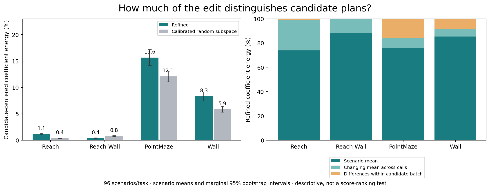

# Inside JEPA-WM: How Latent Steering Changes Planning

A model-biology case study of activation steering inside a **frozen world-model
predictor**: where corrections work, how they vary across imagined actions, and
what changes when a robot plans with them. Built with Python and PyTorch on
[JEPA-WM](https://github.com/facebookresearch/jepa-wms).

[Mechanism analysis](docs/MECHANISMS.md) · [Methods & ablations](docs/METHODS.md) · [Results](docs/RESULTS.md) ·
[Reproduce](docs/REPRODUCING.md) · [GPU execution](docs/COMPUTE.md)

## The finding: a mostly shared latent edit can change which robot trials succeed

On Reach and Reach-Wall, **98.85% and 99.62% of the refined edit's coefficient
energy is shared across candidates within a planning batch**. The four-direction
correction changes much more across planning calls than across the 300 candidate
plans in one call. Yet on fresh Reach scenarios, it changes success/failure on
**42 of 96 trials**: 21 rescues and 21 regressions, leaving the aggregate score unchanged.

That separates two properties often conflated in steering: **changing latent
predictions** and **selectively favoring better actions**. We directly measure the
former and its behavioral consequences; whether the shared or candidate-specific
component drives the decisions remains a testable mechanism hypothesis.



The decomposition covers **768 hash-verified arm records and 40,320 candidate batches**,
aggregated over 96 independent scenarios per task. Random-subspace edits also show
shared components; this is not a property unique to learned directions. A shared
activation shift need not be a shared cost offset in a nonlinear predictor.
[Derivation, alternatives and proposed causal test](docs/MECHANISMS.md).

### Three pieces of evidence

1. **Depth matters.** In the registered rank-one sweep, Reach H6 forecast-error
   reduction falls from **3.03% at B0 to 0.48% at B5**. Reach-Wall shows the same
   early-to-late gradient, and both persist in FP32. Push-T does not reproduce the
   MetaWorld benefit. This maps intervention susceptibility, not a universal physics layer.
2. **Low rank does not mean candidate-specific.** The later rank-four edit uses
   distributed patch directions, but only **1.15% / 0.38%** of its MetaWorld coefficient
   energy distinguishes candidates within a batch. PointMaze and Wall show larger
   candidate-specific shares: **15.65% / 8.30%**.
3. **Aggregate scores hide behavioral reorganization.** Native and refined Reach
   planning both succeed **52/96** times, with different successful scenarios.
   Paired outcomes expose this sensitivity; they do not establish a net improvement.

## Architecture and ablation sites


**V** edits the predictor's visual input; **A** edits block B3's action conditioning;
**R** applies the refined rank-four correction at B3's output. Sites are shown at
imagined step H3 within an H6 forecast. B0–B5 are zero-indexed predictor blocks.
The diagram shows alternative arms, **not three edits applied together**. The frozen
encoders, model weights and CEM objective are unchanged across arms.
CEM repeats candidate proposal/scoring; simulator observations refresh at replanning.
[Exact arm definitions](docs/METHODS.md).

## Layer-by-layer intervention map


These are **measured intervention effects, not attention weights**. Each row edits
one registered layer support at H3; each column measures a later forecast endpoint.
H1–H2 remain unchanged. The heatmap reaggregates saved lineage metrics and includes
all six blocks, B2+B3 and all-block support—without selecting a favorable layer.
Total rank and requested energy are held fixed; BF16 rounding can affect delivered dose.

The B0–B5 gradient is supported by the original paired layer contrasts. It does not
prove that B0 contains a unique physical concept: layer-specific fitting and downstream
computation are alternative explanations. This earlier rank-one sweep is separate from
the later fixed-response rank-four planner experiment.
[Matched-random map](docs/figures/layer_mechanism_bfloat16_random.png) ·
[FP32 map](docs/figures/layer_mechanism_float32_native.png) ·
[All 576 cells and analysis](docs/MECHANISMS.md#layer-response-map).

## Question and hypotheses

A world model predicts candidate actions' consequences; a planner chooses among
those forecasts. We tested whether latent corrections survive that decision step:

- **Forecast correction:** a low-rank activation edit reduces recorded-action prediction error.
- **Direction specificity:** fitted directions help more than similarly sized, calibrated random-subspace or random-direction edits.
- **Behavioral transfer:** corrections improve planning on new scenarios without refitting.

This is task-specific fitting, **not** source-to-unseen-task transfer.
Model weights stay frozen; fitted intervention parameters do not.

## What we ran

1. **Offline development.** Fit directions/readouts on fitting trajectories; measure
   forecast effects on separate recorded trajectories. Corrected primary sweeps
   covered 33 Reach, 27 Reach-Wall and 21 Push-T trajectories, with BF16 primary and
   FP32 sensitivity analyses. Development results informed the recipe.
2. **Behavioral development.** Evaluate released checkpoints across six tasks.
   These earlier cells are reported separately, not as fresh confirmation.
3. **Protected confirmation, completed September 13, 2026.** Freeze the eight-arm
   recipe and analysis, then evaluate 96 new scenarios each on Reach, Reach-Wall,
   PointMaze and Wall: **384 paired scenarios, 3,072 arm evaluations**. Exposure
   checks found no overlap with the fitting/development sources they audited.

### Eight paired arms

| Arm | What it tests |
|---|---|
| Unsteered | Concurrent native planner on the same fresh scenarios |
| Refined four-direction edit | Offline-calibrated response map; one predictor edit, no online response probes |
| Calibrated random subspace | Same rank/support/dose, with its own response calibration |
| Equal-budget vision–action coupling | Joint visual/action-conditioning edit at a fixed standardized-energy budget |
| Dose-matched random directions | Same intervention sites and budget, randomized directions |
| Unscaled joint | Both pathways at their original doses |
| Visual only | Remove the action-conditioning edit |
| Action-conditioning only | Remove the visual edit |

The randomized comparators are **activation edits, not random robot actions**.
The joint/visual/action/native factorial tests pathway contributions and interaction;
the equal-budget joint arm separately tests efficacy at a matched budget.

## Final protected results

Task success (%), **96 scenarios per cell**. Every arm is paired to the concurrent
native row below, not an older checkpoint evaluation on different scenarios.

| Intervention | Reach | Reach-Wall | PointMaze | Wall |
|---|---:|---:|---:|---:|
| Unsteered | 54.17 | 29.17 | 86.46 | 81.25 |
| Refined four-direction | 54.17 | 20.83 | 88.54 | 80.21 |
| Calibrated random subspace | 44.79 | 21.88 | 86.46 | 80.21 |
| Equal-budget coupling | 47.92 | 18.75 | 84.38 | 83.33 |
| Dose-matched random directions | 46.88 | 27.08 | 87.50 | 77.08 |
| Unscaled joint | 52.08 | 22.92 | 84.38 | 77.08 |
| Visual only | 54.17 | 22.92 | 81.25 | 80.21 |
| Action-conditioning only | 47.92 | 17.71 | 81.25 | 78.13 |

The full panel does not establish a reliable net success gain. Its mechanistic value
is in the paired changes, pathway ablations and recorded intervention behavior.
[Paired-effect figure](docs/figures/protected_results.png) ·
[Prespecified uncertainty analysis](docs/RESULTS.md#protected-confirmation) ·
[Exact estimates](reports/fresh-confirmation/report.json).

## Geometry of the fitted edits


These are **fixed basis loadings**, not attention maps or semantic neurons.
An offline-calibrated response map applies the refined edit inside one forward pass,
with no online response probes or extra native-shadow forecasts. It reduced BF16 H6
proprioceptive embedding MSE by **2.36% on Reach and 2.19% on Reach-Wall** in separate
development evaluation. That forecast result is not a physical-task success claim.

Fresh candidate costs and elite ranks were not logged. The next targeted experiment
is to replay the same candidate actions with the full edit, its shared component,
and its candidate-centered component. A head-by-head attention observer is prepared
but has not yet produced GPU measurements; no attention heatmap is implied here.
[Analysis details](docs/RESULTS.md#mechanistic-diagnostics).

## PyTorch GPU execution

We used the [Ultra-Scale Playbook](https://huggingface.co/spaces/nanotron/ultrascale-playbook)
and [JAX Scaling Book](https://jax-ml.github.io/scaling-book/gpus/) as systems references,
**without porting to JAX or doing distributed training**:

- Independent scenario jobs on model replicas; all eight paired arms stay on one physical GPU.
- Batch the planner's **300 candidate trajectories** inside each forecast; preserve the planning budget.
- Stage inputs/checkpoints on worker disks; archive completed records to GCS alongside computation.
- Verify receiving-device behavior, input/source hashes and completed records before collection.
- Account for setup, simulator work, stragglers and transfers; GPU count alone is not throughput.

The model fits on one GPU. No gradient all-reduce, ZeRO/FSDP, tensor/pipeline
parallelism, new FlashAttention implementation or custom CUDA kernels were added
for this campaign. Protected runs retained strict FP32 with TF32 disabled.
We do not claim measured scaling efficiency or a kernel speedup.
[Code and trade-offs](docs/COMPUTE.md).

## Reproduce

```bash
python -m venv .venv
source .venv/bin/activate
python -m pip install -e '.[analysis]'
python scripts/build_readme_figures.py
python analysis/mechanism/steering_specificity.py
python scripts/check_public_results.py
python -m unittest discover -s tests -p 'test_fresh_confirmation.py' -v
```

Figures and summary checks run on CPU from committed aggregates. Raw-result replay
requires archived per-scenario records; model execution also requires pinned upstream
code, simulator dependencies, checkpoints and input banks. **Bulk assets are not
bundled or publicly downloadable from this repo.**
[Hashes, access limits and replay instructions](docs/REPRODUCING.md).

## Scope

One released checkpoint per task; Reach and Reach-Wall share the MetaWorld checkpoint.
No independent-training-seed replication, no no-refit held-out-task experiment,
and no fresh Push-T or DROID confirmation. DROID's earlier recorded-plan score is
not physical-robot success. This is an independent case study, not the authors'
official implementation or a reproduction of their multi-seed training results.

`src/` contains interventions/evaluation; `analysis/mechanism/` contains diagnostics;
`tests/` contains CPU and integration checks; `reports/` and `paper/data/` retain
scientific evidence. Dated development reports are historical, not competing final
results. Operational logs, billing records, working drafts and bulk archives are
excluded from the tracked tree.
