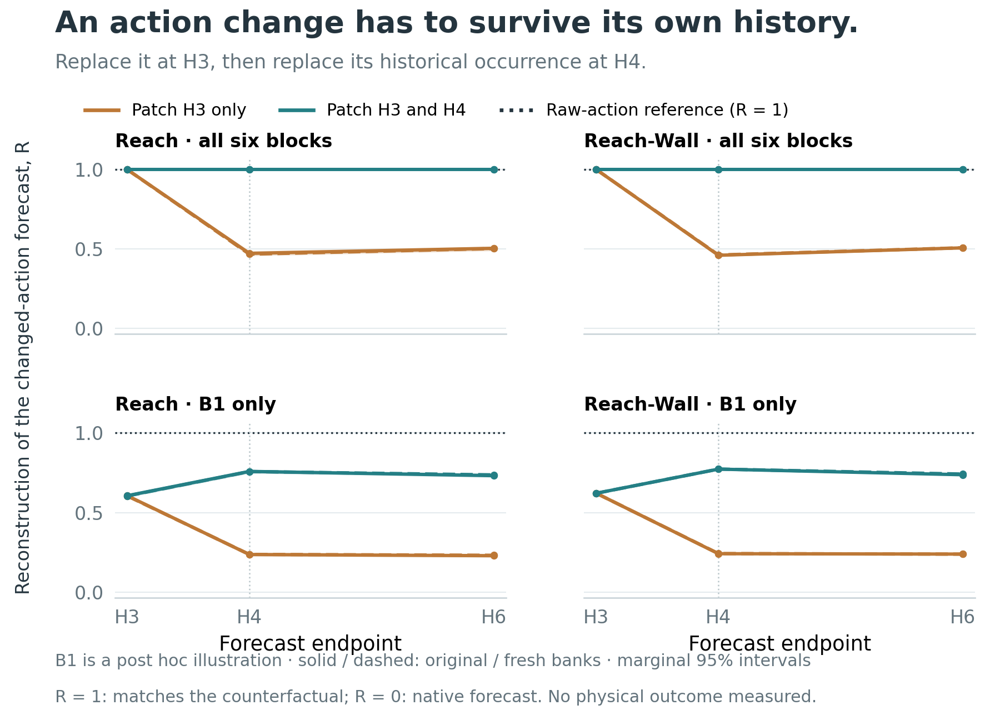
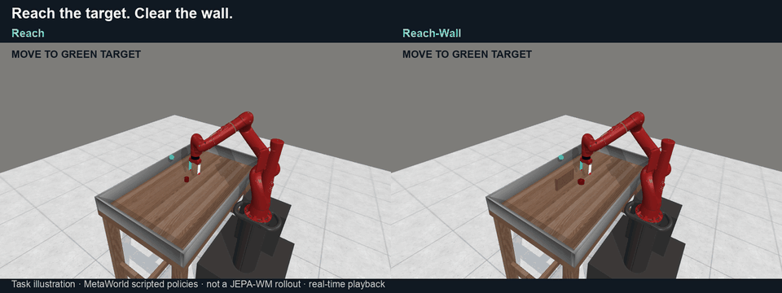

# Steering Predictions and Plans in JEPA World Models

**When does changing a predicted future change the plan?**

JEPA-WM plans by predicting what candidate actions will lead to, then choosing
among those futures. We keep its checkpoints frozen and test **activation
steering inside the predictor**: learned low-rank corrections, visual and
action-conditioning edits, matched random controls, and component ablations.
Representational geometry motivates the edits; forecasting and planning are the
outcomes we follow.

The experiments connect **prediction, context history, and action selection**:

- **A local patch can lose agreement with the intended action change.** Patching
  every appearance across all blocks reproduces its forecast; a one-time patch
  loses about half the reconstruction by H6.
- **Better forecasts and different plans are separate outcomes.** Forecast MSE
  improves **2.36% / 2.19%**. In a separate fixed-bank test, the first choice
  changes in **1/192 states**, while adaptive search can still return different plans.
- **Measured geometry can reverse with precision.** FP32 favors cubic over linear
  reconstruction at every block; BF16 favors linear under the same weights and inputs.

The separate **3,072-run protected evaluation** leaves improved task success
unestablished. These diagnostics do not identify a single cause of that outcome.

[LCFM paper](paper/lcfm/main.pdf) · [Full study](paper/workshop/main.pdf) · [Methods](docs/METHODS.md) · [All results](docs/RESULTS.md) · [Reproduce](docs/REPRODUCING.md)

## Model and interventions

We keep the encoders, six-block predictor, and planning objective fixed.
Interventions enter at imagined step **H3** of an **H6** forecast. CEM scores
300 candidate action sequences against the encoded goal, refits its proposal
from ten elites, and repeats before executing a prefix and replanning.


| Family | Intervention | Control or ablation |
|---|---|---|
| Predictor correction (R) | Learned rank-four edit at B3's output | Response-calibrated random subspace; same rank, site, and prescribed dose |
| Visual–action coupling (V+A) | Visual-input and B3 action-conditioning edits, each scaled by 1/√2 | Random directions with the same sites and dose policy |
| Component ablations | Original-dose joint visual and action edits | Visual-only and action-only |

Together with the unsteered checkpoint, these form eight arms. R and V/A are
alternative interventions. Directions and calibration are fitted on fitting
trajectories; recorded development trajectories inform the recipe. The final
four-task confirmation uses new scenarios after that recipe is frozen.
[Operator equations, fitting, and dose definitions](docs/METHODS.md).

## A changed action must remain changed when it becomes history

We replace an action in the input and compare that rollout with an internal
patch intended to reproduce the same change. The action appears twice in
JEPA-WM's two-frame context: first at H3, then as the older action at H4.
**Patching the first appearance matches the changed-action forecast at H3,
but the agreement breaks when the original action returns at H4.**



The upper panels replace the action-derived condition at all six blocks.
Patching both appearances reproduces the input-action change exactly through
H6; the one-time patch ends near **R = 0.50**. R measures agreement with the
changed-action forecast: 1 is exact and 0 is the unmodified forecast.

The lower panels show B1 as a **post hoc illustration**, where patching both
appearances helps but is not exact. The complete six-layer comparison finds a
positive persistence effect at B0–B3 in both tasks and both banks; B4/B5 remain
unresolved. All sixteen contexts and both candidate banks are retained.

**Why it matters for world models:** a local activation patch can be an incomplete
version of the input change it is meant to represent. Testing only the edited
step misses this. This is agreement with a specified model counterfactual,
not evidence that the counterfactual is physically correct. The tested context
has two frames; we make no context-length scaling claim.
[All six layers, all 72 contrasts, and action-range controls](docs/ACTION_COUNTERFACTUAL.md).

## Better forecasts, first choices, and replanning

### The first choice stays the same in 191 of 192 states

We score the **same 300 action sequences** before and after the learned edit.
The lowest-cost plan stays the same in 191 of 192 states. This is an observed
choice, not a claim that every candidate keeps the same rank.

A simple bound accounts for most of these stable choices. Compare the best
plan's original lead with the largest difference the edit makes between any
two candidates' costs. **If that difference is smaller than the lead, no rival
can overtake the best plan.** This certifies 184 of the 192 cases; it leaves
the other eight undecided, of which one actually changes winner.


Each curve shows how many states fall below a given ratio. Left of 1, the
edit cannot close the winning gap. Right of 1, a changed winner is possible,
but is not guaranteed. All four tested edits and both tasks are shown.

**For a planning objective, prediction error alone leaves a key question open:**
does the correction change which future the planner prefers? This fixed-bank
test answers that question for the initial candidate population.
[Bound, exact counts, and controls](docs/MECHANISMS.md).

### Later search can still produce a different plan

The first winner does not determine the entire CEM search. CEM refits its next
action distribution from ten elite plans, then draws new candidates. Changing
those intermediate selections can alter the later search.


In a separate 56-state replay, both learned and random edits change the returned
action prefixes. Their six registered comparison intervals include zero, so the
learned edit has no established advantage over the random control on these
search measurements. These are differences in planned action coordinates;
physical execution is tested below. [All paired results](docs/CEM_EXPANSION.md).

### Even a shared prediction shift can change relative costs

In a 64-context replay, keeping only the correction shared across candidates
reconstructs the full edit's relative cost changes with scores of **0.983 / 0.998**
on Reach / Reach-Wall. A common shift moves different starting predictions
closer to or farther from the same goal. Candidate-specific edit coefficients
are therefore not required to change relative goal distances.

Random-subspace edits show a similar pattern. The components retain their
original magnitudes; this tests their contribution to the delivered edit,
not their efficacy at equal energy. [Component replay](docs/PILOT_MECHANISMS.md).

## Layer structure and forecast correction

An earlier rank-one sweep measures every predictor block, both visual and
proprioceptive forecasts, six horizons, and FP32/BF16 execution. Early-block edits
produce larger H6 proprioceptive corrections on Reach and Reach-Wall in both
precisions. Push-T has a different response, so the layer pattern is task-dependent.


Cells show MSE reduction as a percentage of unsteered error; positive is better.
H1–H2 precede the H3 intervention. Visual and proprioceptive panels use separate
color scales. The B2+B3 and all-six rows retain the multi-block controls.
[All 576 cells, FP32, and random comparisons](docs/MECHANISMS.md#layer-response-map).

The later **rank-four B3 correction** reduces H6 proprioceptive MSE by **2.36%
on Reach and 2.19% on Reach-Wall**. This operator is fitted separately from the
rank-one sweep; the sweep does not establish where to place the rank-four edit.

## Numerical geometry and attention

### Local reconstruction depends on numerical precision

We test the geometry of the predictor's response along fixed action perturbations.
With the same weights, inputs, and interpolation coefficients, **FP32 favors cubic
reconstruction at every block, while BF16 favors linear reconstruction**.
Rounding only the FP32 outputs removes much of the cubic advantage but does not
reproduce the full BF16 result.


The 64-context control identifies sensitivity to numerical computation. The
separate five-task interpolation study finds small, mixed downstream forecast
benefits after matching requested edit doses. Local reconstruction accuracy
therefore needs its own controls and a separate test of steering utility.
[Controlled arithmetic](docs/CONTROLLED_GEOMETRY.md) · [Five-task geometry and visual–action interactions](docs/PATHWAY_GEOMETRY.md).

### Attention across layers and heads


Each cell averages H6 spatial attention distance over 32 development contexts per
task for the fixed zero-action candidate. This describes the predictor's attention
structure; identifying a causal circuit would require targeted interventions of
the kind used in Joseph et al.'s study. [All horizons and uncertainty](docs/PILOT_MECHANISMS.md).


## Physical execution and behavioral evaluation

In the **56-context physical replay**, every model forecasts every selected plan,
and each prefix executes for fifteen elementary actions from an identical reset.
The learned edit improves same-action forecast error in both tasks. All eight
physical-distance and encoded-goal-cost intervals include zero under the registered
correction. [All paired effects and the 3×3 model/plan grid](docs/PLANNED_PREFIX_REPLAY.md).


The protected evaluation covers **384 fresh scenarios × eight arms = 3,072 runs**
on Reach, Reach-Wall, PointMaze, and Wall. All 48 registered simultaneous contrast
intervals include zero, so this panel does not establish a reliable success gain.
Steering nevertheless changes which scenarios succeed: on Reach, the learned edit
rescues 21 failures and loses 21 successes, leaving both it and unsteered at 52/96.
[All arms and paired uncertainty](docs/RESULTS.md#protected-confirmation).

Development diagnostics and protected behavior use different inputs and planner
randomness. Protected runs did not save numerical candidate costs or elite ranks,
so these diagnostics cannot identify the cause of their outcome changes. Push-T
and DROID remain development-only; DROID measures recorded-action agreement.
[Completed experiments and remaining evidence gaps](docs/ANALYSIS_COMPLETION.md).

## What the simulated tasks require



**Task illustration using MetaWorld scripted policies, not a JEPA-WM result.**
The robot moves to the green target; Reach-Wall adds an obstacle. The clip runs
at simulation speed, with a brief final hold. [HD video](docs/media/task_demonstration_hd.mp4).

Our measured three-arm JEPA comparison retains only the first fifteen actions
(0.19 seconds of simulated motion). It is useful for checking trajectory replay,
but too short to show task completion. [Measured prefixes and verification](docs/media/README.md).

## Benchmark context


### Robot success and published benchmark context

**Unsteered** means the released checkpoint with no activation edit.
**Best observed edit** means the highest success among all **seven activation-edit
arms**, including randomized comparisons. The winning edit is named in each panel;
all ties are retained. This is a **post hoc comparison**, not one fixed method.


Every ablation is eligible; Reach-Wall's winner is **randomized visual–action
coupling: 27.08%**. Error bars show episode standard errors, not uncertainty
adjusted for choosing the best arm.

These are **fresh, protected evaluation scenarios**, not the earlier development
set. That is why the unsteered Reach rate is **54.17% (52/96)** here rather than
the earlier **44.79%**. The gray published bars use different checkpoints and
evaluation populations; they provide context, not paired controls.
[Published source](https://arxiv.org/html/2512.24497v4#S5.T2) ·
[Exact values and error-bar definitions](paper/data/benchmark_comparison_sources.json).

Against concurrent unsteered JEPA-WM, these observed maxima differ by
**0.00 / −2.08 / +2.08 / +2.08 percentage points** on Reach / Reach-Wall /
PointMaze / Wall. Across the full **384 paired scenarios × eight arms = 3,072
evaluations**, we did not establish a reliable overall success improvement.
The internal effects above are findings, not a demonstrated cause of that outcome.
[Paired analysis](docs/RESULTS.md#protected-confirmation).


## Final protected results and earlier benchmarks


Simulator success (%); **DROID is an action-agreement score**, not robot success.
Stages are separate populations, not interchangeable baselines. Protected cells
use 96 scenarios per arm; `—` means not run in that stage.

| Stage | Model / intervention | Reach | Reach-Wall | Push-T | PointMaze | Wall | DROID score |
|---|---|---:|---:|---:|---:|---:|---:|
| Published | DINO-WM | 44.80 | 35.10 | 66.00 | 81.60 | 64.10 | 39.40 |
| Published | JEPA-WM recipe, CEM-L2 | 58.20 | 41.60 | 70.20 | 83.90 | 78.80 | 48.20 |
| Published | JEPA-WM recipe, CEM-L1 | 55.10 | 40.80 | 63.40 | 79.70 | 46.70 | 47.20 |
| Published | JEPA-WM final, CEM-L2 | 49.00 | 29.20 | 69.40 | 83.30 | 80.90 | 46.50 |
| Development | Unsteered | 44.79 | 30.21 | 59.38 | 80.21 | 76.04 | 51.10 |
| Development | Refined four-direction | 51.04 | 31.25 | 59.38 | 85.42 | 78.13 | 51.05 |
| Development | Calibrated random subspace | 50.00 | 23.96 | 61.46 | 79.17 | 76.04 | 51.00 |
| Development | Equal-budget coupling | 48.96 | 26.04 | 61.46 | 77.08 | 82.29 | 51.07 |
| Development | Dose-matched random directions | 60.42 | 28.13 | 60.42 | 84.38 | 77.08 | 51.27 |
| Development | Unscaled joint | 52.08 | 29.17 | 61.46 | 79.17 | 78.13 | 50.85 |
| Development | Visual only | 50.00 | 38.54 | 60.42 | 81.25 | 73.96 | 50.83 |
| Development | Action-conditioning only | 42.71 | 36.46 | 58.33 | 86.46 | 76.04 | 51.11 |
| Protected | Unsteered | 54.17 | 29.17 | — | 86.46 | 81.25 | — |
| Protected | Refined four-direction | 54.17 | 20.83 | — | 88.54 | 80.21 | — |
| Protected | Calibrated random subspace | 44.79 | 21.88 | — | 86.46 | 80.21 | — |
| Protected | Equal-budget coupling | 47.92 | 18.75 | — | 84.38 | 83.33 | — |
| Protected | Dose-matched random directions | 46.88 | 27.08 | — | 87.50 | 77.08 | — |
| Protected | Unscaled joint | 52.08 | 22.92 | — | 84.38 | 77.08 | — |
| Protected | Visual only | 54.17 | 22.92 | — | 81.25 | 80.21 | — |
| Protected | Action-conditioning only | 47.92 | 17.71 | — | 81.25 | 78.13 | — |

Published rows use the authors' checkpoints and aggregation, not our paired inputs.
Development MetaWorld joint/visual/action arms use their concurrent unsteered
**45.83 / 29.17** in contrasts; the canonical development row remains unchanged.
Protected contrasts use **only the protected unsteered row**. No historical rates
are substituted for fresh baselines. [Provenance](paper/data/benchmark_comparison_sources.json).


## What this contributes

The study evaluates a frozen world model at three distinct levels: whether an
internal edit reproduces an intended input change, whether predictions improve,
and whether the planner selects actions with better outcomes. The history test,
score bound, adaptive searches, and physical replays make these questions
separately testable. The layer and precision analyses examine which internal
structures those edits use and how reliably we can interpret them.

Sonia Joseph et al.'s [*Interpreting Physics in Video World Models*](https://arxiv.org/html/2602.07050v1)
provides a reference for the layerwise work. Their **Physics Emergence Zone**
analysis connects physical variables, distributed subspaces, and interventions
in video encoders. We study the action-conditioned predictor and the planning
computations it supports. [Relation to that study, COAST, and Manifold Steering](docs/LITERATURE_MECHANISMS.md).

## Reproduce and inspect

```bash
python -m venv .venv
source .venv/bin/activate
python -m pip install -e '.[analysis]'
python scripts/check_public_results.py
python scripts/check_manuscript.py
python scripts/build_publication_figures.py
```

These checks and figure builds run on CPU from committed aggregates. Full model
replay needs the pinned upstream code, licensed inputs, checkpoints and archived
records; bulk assets are not bundled or publicly downloadable from this repo.
[Complete reproduction instructions](docs/REPRODUCING.md).

`src/` implements interventions and evaluation; `analysis/mechanism/` contains
diagnostics; `tests/` checks them; `paper/data/` and `reports/` preserve the evidence.
Operational logs and bulk assets are excluded. No independent training-seed
replication was performed. This is an independent study, not the authors' official implementation.
