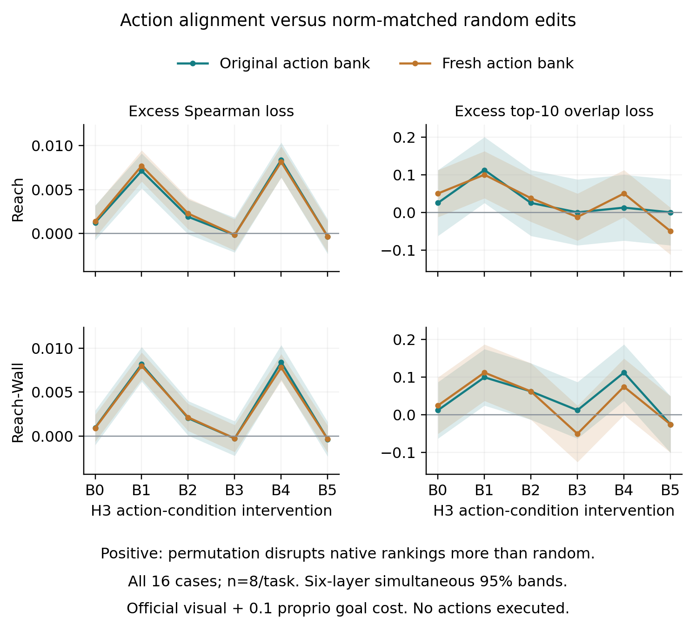

# Does action alignment matter beyond edit magnitude?

Status: all 16 fixed cases and all four full cloud archives passed source-bound CPU validation on 2026-09-13. The [aggregate receipt](../paper/data/action_condition_summary.json) records n=8 scenarios per task, 448 total forecasts, all 1,152 case metric rows, 384 norm-audit summaries, and 144 contrast rows. This experiment remains separate from the attention, cached-replay, and actual-CEM pilots.

## Complete-cohort result

Action-condition permutation disrupts native goal-cost rankings more than a norm-matched isotropic random edit at B1 and B4 in both tasks and both banks. The excess is small: approximately 0.007–0.0084 Spearman correlation units. Every B1/B4 six-layer simultaneous interval excludes zero, but **no layer meets the prespecified 0.05 excess-Spearman pilot flag**. The complete curve has two separated sensitivity peaks; these observations do not establish a unique planning-emergence zone.

| Task / action bank | B1 excess Spearman loss [six-layer simultaneous 95% interval] | B4 excess Spearman loss [same interval] |
| --- | ---: | ---: |
| Reach / original | 0.007133 [0.005150, 0.009116] | 0.008383 [0.006400, 0.010366] |
| Reach / fresh | 0.007704 [0.005925, 0.009483] | 0.008143 [0.006364, 0.009923] |
| Reach-Wall / original | 0.008181 [0.006213, 0.010150] | 0.008408 [0.006440, 0.010377] |
| Reach-Wall / fresh | 0.007997 [0.006461, 0.009533] | 0.007819 [0.006283, 0.009355] |

[Every layer, modality and bank](../paper/data/action_condition_contrasts.csv) remains reported. The intervals test excess relative to zero, not whether B1/B4 exceed every other layer. They are simultaneous across six layers within a task/bank/modality/metric family, not globally across all families.

At B1, permutation loses a mean 1.0–1.125 additional native-top-10 members compared with random edits across the four task/bank cells. Its overlap-loss fractions are 0.10–0.1125 and all four six-layer simultaneous intervals exclude zero. B4's corresponding tail-selection evidence is less consistent despite its positive Spearman excess. Full candidate rankings remain highly correlated with native: mean official-cost Spearman agreement is at least 0.98979 for every task/bank/layer/mode cell. Small global rank changes can therefore coexist with differences among the best ten candidates; neither statistic measures physical action quality.

Visual-only and proprio-only costs show the same broad B1/B4 pattern. The B4 proprioceptive excess is 0.01013–0.01071 across task/bank cells; this effect is not restricted to a proprioceptive endpoint absent from the official objective. These modality comparisons are prespecified secondary results, not additional independent replications.

All 115,200 delivered-norm entries pass: 16 scenarios × two banks × twelve interventions × 300 candidates. Permutation norms match exactly; the largest random-control relative norm error is 2.72×10⁻⁸. No requested-zero case or undefined ranking family occurred. Thus simple delivered-L2 mismatch is not supported as an explanation here. The controls still differ in distribution: a donor condition is a real action embedding paired with another candidate's intermediate state, whereas an isotropic vector can leave the action-embedding subspace. That remaining distinction is examined in the [separately completed action-counterfactual study](ACTION_COUNTERFACTUAL.md); it is not resolved by norm matching alone.

## Fixed question and population

The [prospective protocol](../paper/data/action_condition_protocol.json) fixes IDs 0–7 in Reach and Reach-Wall, n=8 development scenarios per task. Each scenario has its original 300-candidate bank and one fresh bank drawn with the exact native initial-CEM distribution, a private seed `candidate_seed XOR 0x40000000`, zero-mean candidate insertion, and native clipping. Fresh candidate actions are not fresh scenarios or fit-disjoint confirmation.

At H3, each of B0–B5 is tested separately. A cyclic permutation gives candidate `i` the newest action-condition vector of candidate `(i+1) mod 300`. Its control is a private-generator isotropic random perturbation with that candidate's same requested L2 norm. Actual delivered norms are checked for all candidates; components are not normalized using cross-candidate averages. Earlier condition times, recipient action inputs, and the visual/proprio stream are unchanged at intervention entry.

These edits target the action-derived AdaLN condition `z`. They neither edit explicit action tokens nor remove proprioception; proprioception enters the other block input. No model weights are fitted or updated, no CEM search is executed, and no action is sent to a simulator.

## Outcomes and uncertainty

Every arm saves H6 visual, proprioceptive, and official weighted goal-cost arrays. The official cost is visual embedding MSE plus 0.1 times proprioceptive embedding MSE. The analysis recomputes tie-aware Spearman correlation, actual native-top-10 overlap, and cost-change summaries from the same 300 actions within each bank.

The primary contrast is permutation-minus-random excess **loss of native ranking agreement**: `rho_random − rho_permutation`, and `(overlap_random − overlap_permutation)/10`. Positive values mean permutation disrupts the frozen model's ranking more. Native rankings are a reference, not ground-truth physical action quality.

All six layers, both banks, and all three modalities remain in the tables. Scenario bootstrap uses 20,000 paired draws, n=8 per task. The same scenario weights preserve layer/bank pairing. The frozen source supplies marginal percentile intervals and simultaneous six-layer max-absolute-centered-bootstrap-deviation bands, separately within each task/bank/modality/contrast family. These are not simultaneous over every modality and bank. A constant-vector Spearman result is undefined; its full six-layer family is not selectively averaged after dropping cases.

A depth gradient, a shared permutation/random effect, or a bank-specific result does not establish a special planning-emergence zone. The prespecified 0.05 excess-Spearman pilot flag across both banks/tasks is a design threshold, not a validated physical-control margin. Small n cannot exclude small effects.

## Exact controls, source identity, and limits

There are 13 scientific arms per bank: native plus six permutations and six random controls. One extra native all-block H3 zero-clone/capture pass verifies complete H1–H6 forecast and score byte parity. Thus the full 16-case cohort contains 416 scientific forwards and 32 engineering forwards, 448 total, each forecasting a 300-action bank. These are not 448 independent observations.

The execution fixes strict FP32/TF32-off, the assigned GPU UUID, checkpoint and input hashes, and verified local DINO source/weights. A receiving-only v2 amendment moves the native planner's dependency import before the experimental RNG baseline: importing its `nevergrad` dependency initializes NumPy RNG. The failed v1 tagged case is preserved without scores or completion; no scientific arm, seed, metric, or case was changed. The final unchanged-RNG guard still covers native-sampler verification and every forecast, without restoring or masking state.

[The CPU wrapper](../analysis/mechanism/action_condition_summary.py) first reads the frozen v2 execution and input manifests, then requires every case's report, completion marker, cost payload, and full-archive verification receipt. Compact bytes and action-tensor archive membership are source-hash-bound. CPU checks recompute costs, ranks, elite membership, seed rules, and delivered-norm scalar audits. GPU full-forecast/RNG equality remains execution-attested; bulk action tensors are archived but not locally reloaded, and full H6 tensors were computed but not retained.

The wrapper imports the hash-verified frozen implementation without changing it. It refuses partial cohorts and exports all 1,152 arm/layer/modality case comparisons, 384 delivered-norm summaries, and 144 complete-cohort contrast rows. Figure rebuilding checks public-table hashes and keeps all six layers and both banks, including negative or undefined effects.

## Reproduce the completed analysis

Run `.venv/bin/python analysis/mechanism/action_condition_summary.py` with its default frozen v2 paths, then use `--plots-only` for verified-table regeneration. Tests are `tests/test_action_condition_summary.py`; execution-hook tests remain separate in `tests/test_action_condition_specificity.py`. Public figures are exported as PNG/SVG/PDF. The CPU wrapper verifies exact FP32 visual-plus-weighted-proprio cost identity from saved values, and the receipt separates local recomputation from execution-attested full-forecast/RNG checks.
