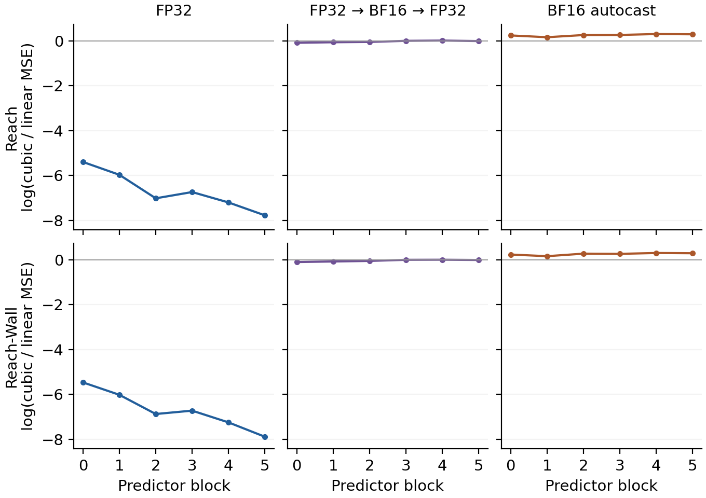

# Controlled action geometry separates output rounding from BF16 rollout

## Result and scope

All **64 predeclared development contexts** completed: 32 Reach and 32 Reach-Wall,
each measured at all six predictor blocks under all three conditions. All 64
original case bundles have cloud download-SHA proofs. The independent CPU audit
accepted every direct-error/Gram, donor-RMS, and finite-difference-RMS identity.
There are 1,152 context × layer × condition rows, not 1,152 independent contexts.
All primary ratios were positive and defined; no context was omitted or assigned
an epsilon.

The controlled test reproduces a large precision sensitivity without changing
the fitting bank, action direction, requested dose, or population between
conditions: **there is no fitted bank or dose normalization in this test**.
Strict FP32 gives much smaller omitted-center error for the four-anchor
interpolant than for the equal-anchor linear mean. Rounding those FP32 fields to
BF16 and back nearly removes that advantage. Actual BF16-autocast rollout goes
further: the interpolant has greater center error than the linear mean at every
block in both tasks.

Output-only rounding therefore explains a substantial degradation but **does
not quantitatively reproduce the actual-BF16 result** under the prospectively
specified 0.1-log-unit practical-match margin. This is a numerical mechanism
result about a frozen predictor, not evidence of a physical manifold, a
planning-emergence zone, or improved control.

*Each point is the mean within-context natural log of cubic-center MSE divided
by linear-center MSE; negative values favor the interpolant. Lines show every
block, not a selected layer. Vertical intervals are marginal paired-context
95% bootstrap intervals, often smaller than markers. All panels use the same
vertical scale. The two right columns differ modestly on this scale but are
resolved by the paired contrasts below. Vector [PDF](figures/paper_controlled_geometry.pdf)
and [SVG](figures/paper_controlled_geometry.svg) are available.*

## Fixed comparison

The [prospective execution protocol](../paper/data/controlled_geometry_protocol.json)
uses the original archived candidate-zero plan, asserted exactly zero, in the
existing IDs 0–31 per task. Only literal normalized model-input action coordinate
0 at H3 varies, with offsets −0.1, −0.05, 0, +0.05, +0.1. All six H3 block-output
fields use the newest 256 visual patches and all feature coordinates. All five
actions are evaluated as one batch. Off-center evaluations were omitted before
outcomes to bound the pilot.

Each condition uses its own zero-offset center. For the same four noncentral
anchors, the linear estimate uses weights `[1/4,1/4,1/4,1/4]`; the interpolant
uses `[-1/6,2/3,2/3,-1/6]`. This symmetric center functional is
**quadratic-compatible**: calling the four-point interpolant cubic does not
identify third-order structure at the center.

The same frozen FP32 checkpoint and once-encoded FP32 image/proprio context are
shared across conditions. “Actual BF16” means CUDA autocast of the recursive
predictor/unroll, including its earlier imagined horizons. It does not mean
BF16 encoder preprocessing, BF16 model weights, every operation in BF16, or one
isolated kernel. The third condition rounds each captured FP32 field to BF16
and restores FP32, without another model forward. Physical GPU UUIDs, original
input bytes, predictor source/configuration, and external DINO source/weights
are bound in execution records. Native-versus-read-only-hook output bytes and
Python/NumPy/Torch CPU/CUDA RNG passed exact parity checks.

## Complete layer table

Entries in the three condition columns are mean log MSE ratios. The final
column is the paired **actual BF16 minus output-round-trip** difference with a
95% simultaneous interval across all six layers within that task/contrast
family. These are not global intervals across every reported comparison.

| Task | Block | FP32 | FP32→BF16→FP32 | Actual BF16 | Paired difference [simultaneous 95%] |
| --- | --- | ---: | ---: | ---: | ---: |
| Reach | B0 | −5.402 | −0.088 | 0.240 | 0.328 [0.308, 0.349] |
| Reach | B1 | −5.974 | −0.064 | 0.160 | 0.224 [0.209, 0.240] |
| Reach | B2 | −7.023 | −0.050 | 0.257 | 0.307 [0.291, 0.323] |
| Reach | B3 | −6.744 | −0.00044 | 0.261 | 0.262 [0.251, 0.272] |
| Reach | B4 | −7.208 | 0.010 | 0.302 | 0.292 [0.275, 0.309] |
| Reach | B5 | −7.783 | −0.011 | 0.290 | 0.302 [0.279, 0.324] |
| Reach-Wall | B0 | −5.464 | −0.098 | 0.238 | 0.336 [0.312, 0.359] |
| Reach-Wall | B1 | −6.018 | −0.073 | 0.163 | 0.236 [0.222, 0.251] |
| Reach-Wall | B2 | −6.874 | −0.047 | 0.277 | 0.324 [0.312, 0.336] |
| Reach-Wall | B3 | −6.724 | 0.002 | 0.268 | 0.265 [0.254, 0.277] |
| Reach-Wall | B4 | −7.248 | 0.006 | 0.306 | 0.300 [0.283, 0.317] |
| Reach-Wall | B5 | −7.888 | −0.005 | 0.295 | 0.300 [0.274, 0.325] |

All twelve lower bounds exceed +0.1; the smallest is approximately +0.209.
Thus the output-rounding and actual-BF16 effects are separated by more than the
chosen practical-match margin in this pilot. We do not report equivalence or
claim that this threshold is calibrated to physical control relevance.

## Analysis and provenance

The [analysis protocol](../paper/data/controlled_geometry_analysis_protocol.json)
fixes 20,000 bootstrap draws with seed 20260913. Whole contexts are resampled
within task, with the same weights across layers and conditions. All three
paired condition differences are retained, alongside raw MSE and response
summaries. A primary aggregate with any undefined context would remain
undefined rather than silently dropping that context. The six-layer
simultaneous bands use the maximum absolute standardized bootstrap deviation;
marginal intervals are descriptive.

For anchor differences \(d_i=f(a_i)-f(0)\), the recorded float64 Gram is
\(G_{ij}=\langle d_i,d_j\rangle/N\). Each reconstruction error is independently
checked against \(w^\top G w\). Donor RMS and both finite-difference RMS values
at radii 0.05 and 0.1 are also reconstructed from this Gram, with explicit
float64 roundoff allowances. Signed finite-difference means are checked against
their RMS bounds; they cannot be reconstructed from a Gram alone. Original
direct tensor errors and byte/RNG parity are execution-attested, not recomputed
from unavailable full tensors. The protocol intentionally retains compact
metrics and Gram matrices rather than huge activation fields.

Reproducible outputs:

- [Summary and all source/cloud identities](../paper/data/controlled_geometry_summary.json),
  SHA256 `623ca7dfec4f1b4d5099f3d656a1827d49b91ad3b46ad15e851f73c36ea8ea5c`.
- [All 1,152 context-level metric rows](../paper/data/controlled_geometry_case_metrics.csv),
  [180 summary rows](../paper/data/controlled_geometry_summary.csv), and
  [36 paired layer contrasts](../paper/data/controlled_geometry_contrasts.csv).
- [Measurement implementation](../src/offline_study/experiments/controlled_geometry_pilot.py)
  and [independent CPU analysis](../analysis/mechanism/controlled_geometry_summary.py).
  Execution manifest SHA256 is
  `b27dd0e0409fab9e6ad1251281edb7456a78e95878978fac2781ce1979108e9c`.

The earlier [pathway geometry comparison](PATHWAY_GEOMETRY.md) involved
precision-specific fits and doses; this controlled diagnostic removes those
particular differences. It still studies one normalized action coordinate near
zero in previously evaluated development contexts, without recorded
counterfactual futures or executed plans. Intermediate rounding, accumulation,
and divergent imagined trajectories remain possible contributors to the gap
between output-only rounding and actual BF16 rollout. No individual kernel,
layer, or physical mechanism is isolated by that residual difference.
