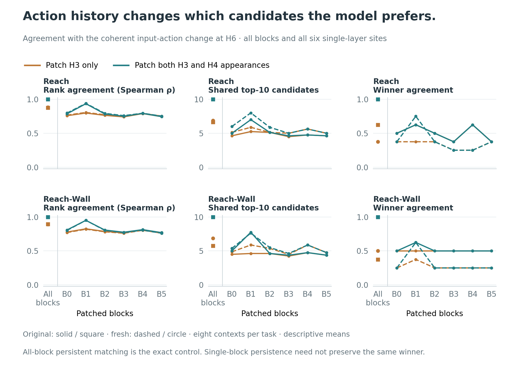

# Action history and candidate selection

Patching both occurrences of an action changes more than reconstruction: it can change which candidate the model ranks first. This is a completed **post hoc reanalysis** of the sixteen-context action-counterfactual experiment, using saved H6 goal costs. No new model inference or physical execution was performed.

## All-block comparison

The coherent raw-action substitution is the reference. Persistent all-block patching reproduces its costs and elites exactly. The H3-only patch disagrees with its winning candidate in **17 of 32 banks** (two banks for each of sixteen contexts). The banks are paired within contexts, not 32 independent scenarios.

| Task | Bank | H3-only Spearman agreement | H3-only shared elites / 10 | H3-only different winner / 8 | Persistent different winner / 8 |
|---|---|---:|---:|---:|---:|
| reach | original | 0.8775 | 6.625 | 3/8 | 0/8 |
| reach | fresh | 0.8814 | 6.875 | 5/8 | 0/8 |
| reach-wall | original | 0.8940 | 5.750 | 5/8 | 0/8 |
| reach-wall | fresh | 0.8907 | 6.875 | 4/8 | 0/8 |

Persistent all-block Spearman agreement is 1 and elite overlap is 10 in every bank. That exact equality follows from the earlier full-computation parity control. The additional observation is that omitting the historical occurrence changes candidate ordering, elite membership, and often the best candidate. These are fixed-bank scoring decisions; a complete adaptive CEM search was not rerun.

## All sites and both banks



B1 shows a persistent-minus-H3-only Spearman gain of 0.1249–0.1371 and 1.75–3.125 additional shared elites on average. Winner agreement improves in three of its four task/bank cells and is unchanged in Reach/original. Direct patch-to-patch winner changes still occur there: changing a winner need not move it toward the reference. B0–B4 have positive mean Spearman differences in every bank; B5 has small negative differences (−0.000154 to −0.000083). These are descriptive means over the eight recorded contexts, with no new significance tests.

Every row below is retained. Positive differences mean closer agreement with the coherent action-change reference. “Direct winner changes” compares persistent with H3-only regardless of which agrees with the reference.

| Task | Bank | Site | Δ Spearman | Δ shared elites | Net gain in reference winner matches / 8 | Direct winner changes / 8 |
|---|---|---|---:|---:|---:|---:|
| reach | original | all_blocks | +0.122478 | +3.375 | +3/8 | 3/8 |
| reach | original | B0 | +0.027198 | +0.375 | +0/8 | 0/8 |
| reach | original | B1 | +0.137067 | +1.750 | +0/8 | 3/8 |
| reach | original | B2 | +0.020987 | +0.000 | +0/8 | 0/8 |
| reach | original | B3 | +0.009449 | +0.125 | +0/8 | 0/8 |
| reach | original | B4 | +0.002579 | +0.000 | +0/8 | 0/8 |
| reach | original | B5 | -0.000154 | +0.000 | +0/8 | 0/8 |
| reach | fresh | all_blocks | +0.118626 | +3.125 | +5/8 | 5/8 |
| reach | fresh | B0 | +0.029560 | +0.875 | +0/8 | 1/8 |
| reach | fresh | B1 | +0.133059 | +2.125 | +3/8 | 4/8 |
| reach | fresh | B2 | +0.020670 | +0.750 | +0/8 | 0/8 |
| reach | fresh | B3 | +0.009011 | +0.000 | +0/8 | 0/8 |
| reach | fresh | B4 | +0.002170 | +0.000 | +0/8 | 1/8 |
| reach | fresh | B5 | -0.000117 | +0.000 | +0/8 | 0/8 |
| reach-wall | original | all_blocks | +0.106013 | +4.250 | +5/8 | 5/8 |
| reach-wall | original | B0 | +0.030341 | +0.500 | +0/8 | 0/8 |
| reach-wall | original | B1 | +0.124930 | +3.125 | +1/8 | 2/8 |
| reach-wall | original | B2 | +0.020350 | +0.000 | +0/8 | 1/8 |
| reach-wall | original | B3 | +0.009045 | +0.125 | +0/8 | 0/8 |
| reach-wall | original | B4 | +0.001983 | +0.000 | +0/8 | 0/8 |
| reach-wall | original | B5 | -0.000108 | +0.000 | +0/8 | 0/8 |
| reach-wall | fresh | all_blocks | +0.109306 | +3.125 | +4/8 | 4/8 |
| reach-wall | fresh | B0 | +0.031370 | +0.500 | +0/8 | 0/8 |
| reach-wall | fresh | B1 | +0.130574 | +1.750 | +2/8 | 4/8 |
| reach-wall | fresh | B2 | +0.020982 | +0.125 | +0/8 | 0/8 |
| reach-wall | fresh | B3 | +0.009656 | +0.125 | +0/8 | 0/8 |
| reach-wall | fresh | B4 | +0.001941 | +0.000 | +0/8 | 0/8 |
| reach-wall | fresh | B5 | -0.000083 | +0.000 | +0/8 | 0/8 |

## Method and provenance

- **Fixed scope:** both tasks, contexts 0–7, both original/fresh banks, all-block and B0–B5 sites, and all three requested endpoints. [Protocol](../paper/data/lcfm_history_ranking_protocol.json) was committed before calculating the new pairwise comparisons. This remains a post hoc development analysis because its motivation and original reconstruction results were already known.
- **Reference:** the coherent raw H3 action substitution. Secondary comparisons retain persistent versus H3-only directly and native versus the coherent reference. Agreement with native is not substituted for counterfactual agreement.
- **Cost:** the archived H6 FP32 visual goal MSE plus 0.1 times proprioceptive goal MSE, over the same 300 candidate IDs. Only H6 cost arrays were retained; the H3/H4 reconstruction endpoints do not supply rankings.
- **Ranking:** Spearman correlation with averaged ranks for exact ties. A constant cost vector is undefined; no context is dropped to calculate a selective mean.
- **Elites:** intersection of the actual archived top-ten sets, with membership checked against their costs.
- **Winners:** lowest candidate ID among exact minimum-cost ties. Minimum-set intersections and cutoff ties are audited separately. In these records all minima are unique and no top-ten boundary is tied, so all reported winner mismatches are unambiguous.
- **Aggregation:** eight contexts per task, with banks and sites shown separately. All 704 pairwise records, 224 paired-difference records, and 84 mean differences are published. There are no new tests, confidence intervals, layer selection, or outcome-dependent omissions.
- **Source validation:** 80 original archive members and sixteen cloud readback receipts match the original completed-analysis hashes. The export retains 512 official cost vectors. An independent SciPy/NumPy recount agrees on all 704 rank/elite/winner comparisons.

## Reproduce on CPU

```bash
python -m analysis.mechanism.lcfm_history_ranking --output /tmp/lcfm-ranking-reproduction
python scripts/build_lcfm_ranking_figure.py
python -m pytest -q tests/test_lcfm_history_ranking.py
```

The analysis command uses the committed cost-vector export and refuses to overwrite existing outputs. To rebuild that export from the original preserved case files, use `--export-source PATH_TO_COMPLETE16_CASES --output NEW_DIRECTORY`.

[Analysis code](../analysis/mechanism/lcfm_history_ranking.py) · [Input vectors](../paper/data/lcfm_history_ranking_inputs.json) · [Input checksum manifest](../paper/data/lcfm_history_ranking_inputs_manifest.json) · [Analysis receipt](../paper/data/lcfm_history_ranking_report.json) · [All case metrics](../paper/data/lcfm_history_ranking_cases.csv) · [All paired differences](../paper/data/lcfm_history_ranking_paired_differences.csv)
