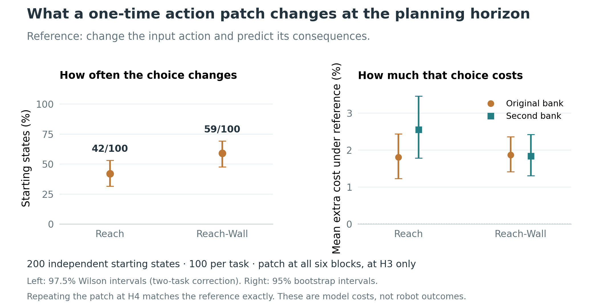
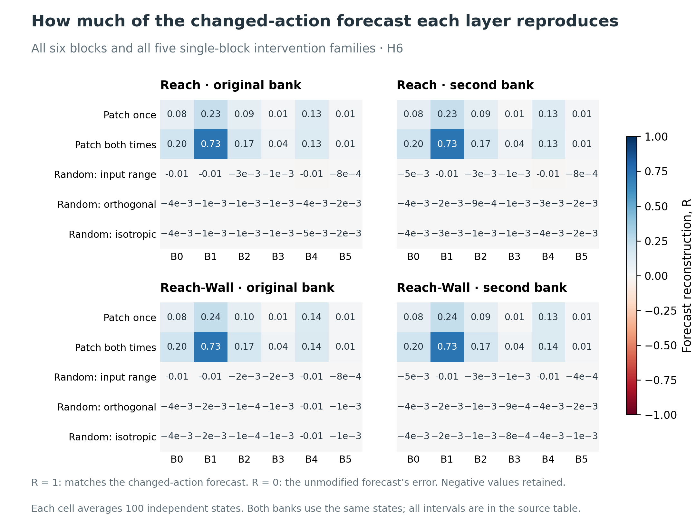

# When an action patch changes the predicted plan

Completed replication: **200 independent starting states, 100 each on Reach and
Reach-Wall; 35 conditions and two banks of 300 candidates per state; 14,000
six-step forecasts.** The earlier sixteen-state study remains separate.

## What we tested

We change one input action and ask whether an internal activation patch reproduces
the resulting JEPA-WM forecast and candidate selection. The reference is the same
frozen model run with that action changed at its input. The unmodified input is a
second baseline for measuring the size of the forecast change.

The predictor uses two frames of context. The changed action appears in the newest
position at H3 and in the older position at H4. We replace its conditioning at H3
only, or at both appearances. The all-block comparison tests timing; single-block
edits and matched random directions test where the effect occurs.

The primary endpoint is whether the all-block H3-only patch chooses a different
candidate at H6 from the changed-input reference, using the original bank.
The primary comparison, all 200 inputs, and the analysis were fixed before inference.

## How often does the selected candidate change?

| Task | Different candidate / independent states | Fraction | Interval with two-task correction |
|---|---:|---:|---:|
| Reach | 42/100 | 42% | 31.6–53.2% |
| Reach-Wall | 59/100 | 59% | 47.8–69.3% |

These are 97.5% Wilson intervals for each task, using Bonferroni correction for
95% coverage across the two task estimates. A changed candidate is a disagreement
with the reference selection; it is not a robot success or failure.



## How large is the cost difference?

For each state, we score the candidate selected by the patch under the reference.
We subtract the reference minimum and divide by that minimum, then average across
all 100 states, including states with unchanged selections. This gives the size of
the selection difference in the model’s planning objective.

| Task | Candidate bank | Mean excess reference cost [95% bootstrap interval] |
|---|---|---:|
| Reach | Original | 1.81% [1.24, 2.44] |
| Reach | Second | 2.56% [1.79, 3.46] |
| Reach-Wall | Original | 1.87% [1.41, 2.36] |
| Reach-Wall | Second | 1.84% [1.31, 2.43] |

The two banks contain different candidate sequences for the same starting states.
They are paired measurements, so the independent sample stays at 100 per task.
These secondary intervals are marginal and descriptive. The experiment scores fixed
candidate banks; it does not execute the selected plans or rerun adaptive CEM.

## Forecasts, layers, and controls

Reconstruction compares the patched forecast with the changed-input forecast:

`R = 1 − D(patch, changed input) / D(unmodified, changed input)`

`D` averages visual MSE plus 0.1 times proprioceptive MSE across candidates before
taking the ratio. `R = 1` means an exact match; `R = 0` means the unmodified
forecast’s error. Negative values are retained. The value is an error ratio,
not a fraction of an activation or a physical effect.



The complete condition registry contains unmodified input, a zero-edit capture
control, the changed-input reference, two all-block timing conditions, and five
conditions at each of six layers. Each layer has a one-time donor patch, a patch
at both appearances, and norm-matched random directions in the action encoder’s
range, its orthogonal complement, and the full conditioning space.

The persistent all-block patch is an exact computational consistency control.
Per-case audits check full-horizon equality with the changed-input reference,
unchanged H1/H2 outputs, zero-edit parity, private random streams, and edit norms.
All layer and random-control results are retained, including negative values.

## Sampling and uncertainty

Each state has its own frozen environment seed. Initial states, goals, and seed
records were checked against retained project exposures before inference. Engineering
inputs are separate and excluded. The original sixteen development states are not pooled.

Secondary intervals use 20,000 paired bootstrap draws over states, with seed
`2026091421`. The same resampling weights apply across conditions and banks.
Tied minima use the first candidate ID; minimum-set membership and tie counts
are also retained. Undefined metrics remain explicit rather than dropping states.

This replication estimates the frequency and model-cost size of a history-related
selection mismatch. The model has a two-frame context and an H6 horizon. Testing
longer context lengths or better robot outcomes requires separate experiments.

## Evidence and reproduction

| Artifact | SHA256 |
|---|---|
| Frozen protocol | `967aebfd743fe2bfb226bef2915dbebbac31f4c816f84f987ed514a3356c9204` |
| Analysis source | `86d200c53ddc7a3eb2d9123fab434b0b13e3d8c2cf54c421170166c16ab38775` |
| Complete summary | `3769fa71bad0f6e954a6a801a7c23df9ed6abc96ff53958caf5e4a2dc628883e` |

[Frozen protocol](../paper/data/lcfm_replication_protocol.json) ·
[Complete summary and case provenance](../paper/data/lcfm_replication_summary.json) ·
[All secondary estimates](../paper/data/lcfm_replication_secondary.csv) ·
[Per-state selection measurements](../paper/data/lcfm_replication_rank_cases.csv.gz) ·
[Per-state reconstruction measurements](../paper/data/lcfm_replication_reconstruction_cases.csv.gz)

Every completed case has a generation-pinned GCS archive with a full download-SHA
check and hashes of all original result files. Those private raw archives require
authorized storage access; the derived tables above are committed to the repository.

Regenerate figures, report, and manuscript values from the public tables:

```bash
python scripts/check_lcfm_replication.py
python scripts/build_lcfm_replication_figures.py
python scripts/write_lcfm_replication_report.py
python scripts/write_lcfm_replication_numbers.py
```

To repeat the statistical aggregation after restoring all 200 verified case audits:

```bash
python -m analysis.mechanism.lcfm_replication_summary aggregate \
  --cases RESTORED_AUDITED_CASES --output NEW_ANALYSIS_DIRECTORY
```

The aggregator rejects incomplete cohorts, repeated states, changed protocols,
and cases without cloud verification. It retains every registered condition.

[Earlier sixteen-state reconstruction study](ACTION_COUNTERFACTUAL.md) ·
[Earlier ranking reanalysis](LCFM_HISTORY_RANKING.md) ·
[Design and sample-size rationale](LCFM_FOLLOWUP_DESIGN.md)
