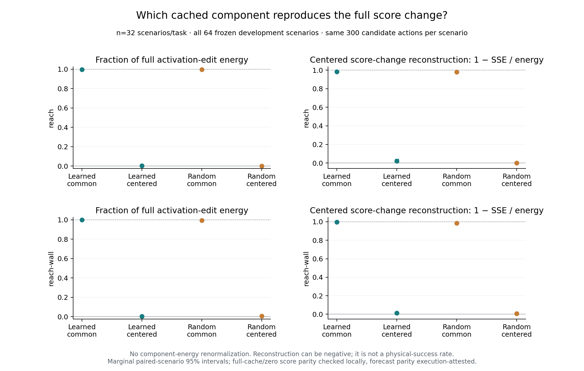
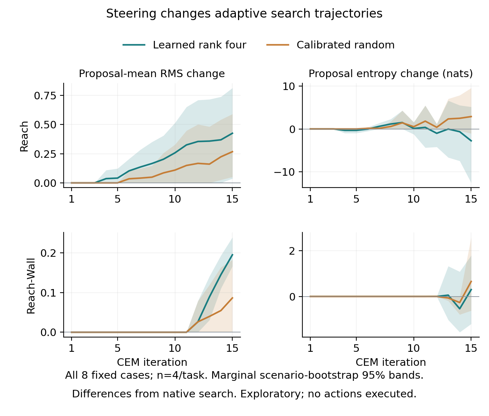

# Native attention, CEM proposals, and cached-component replay

Status: all 64 frozen development cases passed compact-source, coverage, and parity validation on 2026-09-13: IDs 0–31 in each MetaWorld task, n=32 per task. The separate actual-CEM addon also passed with all eight fixed cases, n=4 per task. No partial-cohort means are reported. All 64 required result payloads, including the initial eight bulk H6 payloads, now have verified durable readback. The later 56 cases retain compact metrics under their fixed logging policy, not full activation tensors. The [source receipt](../paper/data/pilot_summary.json) records zero pending cases; this preservation refresh leaves every scientific CSV hash unchanged.

The [analysis protocol](../paper/data/pilot_summary_protocol.json) fixes the populations, metrics, controls, resampling unit, and exact execution-manifest hashes before the development summary. [pilot_summary.py](../analysis/mechanism/pilot_summary.py) reads the execution/input manifests before any case results and refuses incomplete cohorts, duplicate cases, mixed checkpoint/fit identities, changed hashes, or failed parity checks. The original eight cases are reused exactly once under their original source binding, not treated as fresh replications within the expansion.

Both the 64-case pilot and eight-case addon use strict FP32 forwards with TF32 disabled, as specified in their hash-bound execution manifests. They are not BF16 reruns of the earlier offline forecast experiment. The original task-specific fitted banks remain frozen and source-hashed; these diagnostics do not refit them.

## Complete-cohort findings

The candidate-common cached field reproduces most of the full correction's candidate-relative score change, for learned and calibrated-random arms alike. These are scenario means over all 32 cases per task, without component-energy renormalization. The reconstruction statistic is defined below; it is neither explained physical behavior nor an efficacy rate.

| Task / arm | Common activation energy | Common-only score reconstruction | Centered-only score reconstruction |
| --- | ---: | ---: | ---: |
| Reach / learned | 99.5293% | 0.982664 | 0.021819 |
| Reach / random | 99.7709% | 0.979456 | 0.001555 |
| Reach-Wall / learned | 99.7807% | 0.997536 | 0.013490 |
| Reach-Wall / random | 99.4156% | 0.985434 | 0.008097 |

[All estimates and marginal scenario-bootstrap intervals](../paper/data/pilot_summary_component_summary.csv) retain every case; all reconstruction denominators are defined. Learned common-only reconstruction has 95% intervals [0.979273, 0.985782] in Reach and [0.997093, 0.997961] in Reach-Wall. Adding the common-only and centered-only score changes reconstructs the full change at 0.999997–0.999999 across the four cells. This shows near-additivity of this particular downstream score response at the original component magnitudes, not globally linear network geometry.

The original fixed candidate bank largely retains its elite set: learned full edits keep a mean 9.90625/10 native elites in Reach and 9.96875/10 in Reach-Wall. Centered-only edits retain 10/10 in every task/arm/case. The matching random full-arm means are 9.875 and 9.9375. These small fixed-bank changes do not imply identical adaptive search, as the separate addon below demonstrates. [Replay estimates](../paper/data/pilot_summary_replay_summary.csv)

Native CEM's pre-clipping Gaussian entropy falls from 170.2726 nats initially to 24.8917 [16.6858, 32.8326] in Reach and 32.5524 [25.6821, 39.3377] in Reach-Wall before iteration 15. Mean best/runner-up margins shrink from 0.05957 to 0.00245 and from 0.06542 to 0.00339, respectively. These are measured properties of the native optimizer's search, not evidence that it becomes certain about physical outcomes. All 960 iteration rows have entropy and margins independently recalculated from the compact arrays. [CEM figure](figures/pilot_attention_cem.pdf), [estimates](../paper/data/pilot_summary_cem_summary.csv)

The [spatial](figures/pilot_attention_spatial.pdf) and [temporal](figures/pilot_attention_temporal.pdf) attention grids expose substantial head heterogeneity within the same block. For example, the all-head H6 spatial means span 1.106–9.521 patches in Reach and 1.124–9.507 in Reach-Wall. This is descriptive, not a selected head intervention or a discovered emergence zone. The zero H1 temporal distance is forced by its one-frame context; H2–H6 use two frames. The public table retains all 36,864 scenario/head/layer/horizon observations and all 4,608 metric means, rather than treating heads as extra samples.

## Three measurements, three denominators

| Measurement | Fixed input and scope | Independent unit | What it does not measure |
| --- | --- | --- | --- |
| Native attention | One archived candidate-zero, zero-action plan per scenario; every block B0–B5, head 0–15, horizon H1–H6 | Scenario; 32 per task in complete64, or four in instrumentation8 | Causal head importance, arbitrary action-conditioned attention, or attention entropy |
| Native CEM | Actual 15 iterations × 300 candidates, 10 elites; unchanged native planner and per-scenario seed | Scenario, not 4,500 candidate scores | Physical success or uncertainty about physical outcomes |
| Cached correction replay | Same original 300-action bank for native, learned rank-four, and calibrated random rank-four arms; full/cache/zero/common/centered variants | Paired scenario, not 300 candidates | A closed-loop intervention result or a new fitted controller |

No simulator or new physical outcomes are involved. These are historical development inputs, not untouched confirmation. The source does not establish disjointness from all fitting inputs, so this report makes no such claim. The original one-fit-trajectory engineering pilot remains separate and is never pooled with the development scenarios.

## Attention is a distance map, not a causal map

The observer receives actual post-RoPE query/key tensors and the native attention mask, calculates diagnostics in chunks, and calls the original attention kernel unchanged. It reports visual-query to visual-key attention-weighted spatial distance in patch units and temporal distance in frame units. Conditioning-token mass and visual-token mass are retained separately.

All six layers, sixteen heads, and six forecast horizons remain in the public tables and heatmaps; no layer or head is selected for a favorable result. Color scales are shared across tasks/horizons within a metric. Cells show scenario means; marginal scenario-bootstrap intervals are in the table. Heads are features of one model, not independent experimental subjects.

Per-case tables retain context length `T` and patch-grid dimensions. A distance change across rollout horizons can reflect the available context as well as attention behavior; it is not automatically a new computational phase. Comparisons between layers at the same horizon hold that layout fixed.

`action_tokens=0` means actions do not appear as extra attention tokens in this configuration. The predictor still receives action conditioning through AdaLN; zero conditioning-token attention mass does not show that actions are ignored. This pilot uses one fixed zero-action plan for attention and cannot by itself estimate how head geometry changes across candidate actions.

## CEM entropy is the actual pre-clipping proposal entropy

The native sampler exposes its diagonal Gaussian standard deviation before random sampling, action clipping, and insertion of the proposal mean as a candidate. For its 120 coordinates, entropy is `sum(log(std) + 0.5*log(2*pi*e))`, in nats. This is differential entropy: negative values are valid, and its magnitude depends on action coordinates/units. It is not the entropy of the clipped action distribution.

The fifteen-iteration figure pairs this quantity with best/runner-up and elite-boundary objective-cost margins. The compact summaries are bound to their archived native traces; when per-iteration standard deviations, costs, and actual elite IDs are included, the CPU reanalysis recomputes entropy and margins. If a legacy compact trace has only scalars, the table marks these as source-attested rather than independently recalculated.

Proposal entropy, a softmax over candidate costs, attention entropy, and coefficient-spectrum entropy concern different objects. Neither attention entropy nor coefficient-spectrum entropy is present in this pilot, and the report does not substitute a distance or energy statistic for either one.

## What the cached-component test isolates

For a given frozen arm, let its original correction field on candidate `i` be `delta_i`. The source captures that field once at the original native H3/B3 input. It decomposes it into a candidate-common mean `mu` and a centered remainder `epsilon_i=delta_i−mu`. Subsequent component replays reuse this exact cache, without refitting, recomputing the correction from a modified rollout, or rescaling either component to match the full field's energy.

The common/centered activation-energy fractions sum to one up to numerical precision. This decomposition controls the input/correction identity, but it deliberately does not equalize component energy. A small centered effect therefore is not evidence that an equal-energy centered edit would be ineffective.

For each replay, costs are compared across the same 300 actions. After subtracting native costs, the change vector is centered across candidates. The score-reconstruction diagnostic is `1 − ||full_change−component_change||² / ||full_change||²`. It equals one for perfect reconstruction, may be negative, and is undefined when the full centered change is zero. It is never clipped to a success-like 0–1 range, and undefined scenarios are not silently dropped from an aggregate.

The sum of common-only and centered-only cost changes is also compared with the full cost change. This is nonadditivity of the downstream score functional, not the output-tensor factorial decomposition in [PATHWAY_GEOMETRY.md](PATHWAY_GEOMETRY.md). A candidate-common activation shift can still change relative squared-distance goal costs; being common in activation space does not make it irrelevant to planning.

Learned and calibrated-random arms are retained throughout. The public tables include per-scenario score means/RMS, centered RMS, actual native-elite overlap, both margins, component energy fractions, reconstruction scores, and paired learned-minus-random contrasts. All means and marginal 95% bootstrap intervals use scenarios within task, not heads or candidates. These are descriptive comparisons, not multiplicity-corrected discoveries.

## Evidence and validation boundary

Each complete case requires its original `report.json`, `DONE.json`, `attention.json`, `scores.json`, derived `cem_summary.json`, and verified-cloud preservation receipt. Original compact files must match the hashes in the case report; the CEM summary must have its own preservation hash and parent trace hash. The cloud receipt must attest archive-member verification and downloaded archive hash agreement. The aggregate receipt records these source bindings and all exported-table hashes.

The initial analysis used verified compact records while the first eight bulk H6
archives were being preserved. All 64 cases now have their required archives
verified, with `raw_preservation_pending_case_count=0` and
`all_raw_preservation_complete=true` in the source receipt. Updating preservation
status left the scientific CSV hashes unchanged.

Full/cache and native/zero score arrays are checked exactly on CPU. Exact H6 forecast and unchanged-RNG checks were executed on the GPU; the CPU report labels these as execution-attested because the bulk H6 tensors stay in cloud storage. Cases 0–3 per task preserve full H6 forecasts; later cases compute and check them but archive scalar summaries rather than those bulk tensors. This is a retention difference, not extra independent evidence.

The report distinguishes locally verified bytes, hash-bound derived summaries, and
identities checked during model execution. Original records remain preserved; the
aggregate rejects failed or missing evidence.

## Separate prospective eight-case actual-CEM addon

Before development outcome summaries were inspected, a separate [eight-case addon protocol](../paper/data/cem_steering_protocol.json) fixed IDs0–3 in both tasks for actual learned and calibrated-random steering throughout the native fifteen-iteration CEM search. This is distinct from the 64-case shared-candidate replay: later candidate proposals now adapt to each intervention's own scores. The original per-scenario seeds and earlier native traces are the comparators, with exact traced/untraced selected-plan and RNG checks for each new arm. No simulator is used.

The addon reports paired selected-prefix L2/RMS differences over the actual returned `(3,20)` action prefix: 60 coordinates, preserved without reshaping or padding. The full proposal mean is `(6,20)` and the proposal distributions span 120 coordinates; those are different objects. The native engineering trace established this schema correction before development outcome summaries. Per-iteration metrics remain proposal entropy differences, proposal-mean and proposal-standard-deviation L2/RMS divergence, and within-population cost margins. Gaussian entropy retains the same pre-clipping meaning and may be negative. A changed prefix or proposal is an instrumentation finding, not improved physical control; no action is executed in this addon.

Only iteration0 can report common-candidate elite overlap or paired candidate-score differences, and only after actual action-array identity is established from arrays or identically defined hashes, shapes, and dtypes. Equal seeds alone are insufficient. At later iterations, candidate index17 under one arm need not denote the same action as index17 under another arm. Those rows therefore intentionally omit elite-ID overlap and paired candidate-score differences, even when IDs happen to match.

[cem_steering_summary.py](../analysis/mechanism/cem_steering_summary.py) keeps this addon in separate `cem_steering_*` tables/receipt. It requires all eight preserved cases and binds each native comparator to its original completion report, input/seed binding, and trace hash. Uncertainty is marginal paired-scenario bootstrap, n=4 per task; this is explicitly instrumentation/exploratory, not an efficacy sample. All eight cases now have verified full archives, recorded in the [addon receipt](../paper/data/cem_steering_summary.json).

The first candidate population is exactly shared and all sixteen task/scenario/arm comparisons retain 10/10 native elites. Nevertheless, after the complete fifteen-iteration searches the returned prefixes differ:

| Task / arm | Mean returned-prefix RMS change [marginal 95% interval] | Mean proposal-mean RMS change before iteration 15 |
| --- | ---: | ---: |
| Reach / learned | 0.50253 [0.09427, 0.91078] | 0.42530 |
| Reach / random | 0.31089 [0.06919, 0.61190] | 0.26731 |
| Reach-Wall / learned | 0.24657 [0.20509, 0.29959] | 0.19529 |
| Reach-Wall / random | 0.11214 [0.00000011, 0.22427] | 0.08647 |

The first column uses the actual 60-coordinate returned prefix; the last uses all 120 proposal coordinates. [Prefix estimates](../paper/data/cem_steering_selected_prefix_summary.csv), [all iteration estimates](../paper/data/cem_steering_iteration_summary.csv). Learned entropy changes before iteration 15 are −2.7653 nats in Reach and +0.3009 in Reach-Wall; random changes are +2.8936 and +0.6562. All four marginal intervals span zero. Thus these eight cases establish altered adaptive search and selected prefixes, not a consistent entropy direction or improved plan quality. Nothing in this addon executes the returned actions.

An engineering-only v2 amendment corrects the callback-count guard: each fifteen-iteration search makes fifteen population-batch forecasts plus fifteen updated-mean forecasts, hence thirty unroll callbacks per traced or untraced search. The original guard expected fifteen and stopped two attempts before completion. Those v1 logs remain preserved without `DONE`; they are not successful cases or extra scientific samples. The v2 manifest changes this guard, not the fixed seeds, arms, or planner algorithm.

## Reproduce the completed analysis

For complete64, pass both frozen execution manifests and both corresponding input manifests using repeated `--execution-manifest` and `--input-manifest` arguments to `.venv/bin/python analysis/mechanism/pilot_summary.py --cohort 64`. Its default compact directory includes only the original `development-v1` and `expansion-v2` result roots, excludes the separate actual-CEM addon, and rejects duplicate task/episode reports. The eight-case fallback requires `--cohort 8` and only its original execution/input manifest; its receipt and all figures say instrumentation-only.

Public-table figure rebuilding uses `.venv/bin/python analysis/mechanism/pilot_summary.py --plots-only`, after checking the table hashes in the completed receipt. The script exports spatial/temporal attention grids, native CEM entropy/margins, and cached-component energy/reconstruction comparisons as PNG/SVG/PDF. Tests run with `.venv/bin/python -m unittest discover -s tests -p 'test_pilot_summary.py' -v`.

For the separate addon, run `.venv/bin/python analysis/mechanism/cem_steering_summary.py` with the frozen v2 execution manifest, its SHA256, and `compact/steered-cem-v2` as the compact root. `--plots-only` checks the complete-eight receipt and public CSV hashes before rebuilding the 6.8-inch-wide PNG/SVG/PDF search figure. Its tests are `test_cem_steering_summary.py`; they include the actual `(3,20)` prefix layout, forbidden later-iteration candidate-ID comparisons, and plot-input tamper rejection. Analysis source hashes are recorded in the regenerated receipts.
