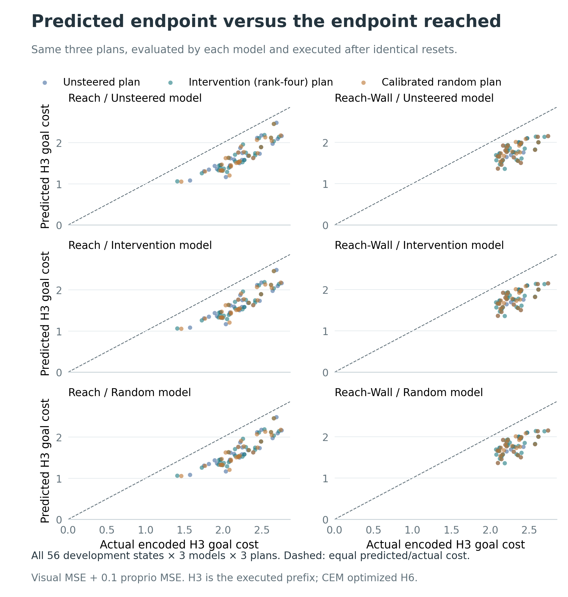

# Selected-prefix prediction versus physical execution

Status: **complete, 56/56 development contexts**, with all original physical records and parent CEM records cloud-download-SHA verified. The simulator passed the required receiving checks. CPU analysis validates the frozen sources and receipts and recomputes paired contrasts from the compact records. This is an H3 prefix experiment, not full-task success or a new protected evaluation.

## Completed results

The learned rank-four predictor reduces weighted forecast MSE on the **same unsteered-selected prefix** in both tasks. That forecast result does not translate into an established physical-prefix benefit: all eight physical endpoint intervals include zero.

| Task | Learned minus unsteered endpoint | Mean | Simultaneous 95% interval |
|---|---|---:|---|
| Reach | Same-prefix forecast MSE | −0.002720 | [−0.003061, −0.002342] |
| Reach-Wall | Same-prefix forecast MSE | −0.002268 | [−0.002607, −0.001905] |
| Reach | Terminal end-effector distance | −0.000411 | [−0.003010, +0.002176] |
| Reach-Wall | Terminal end-effector distance | −0.000511 | [−0.002236, +0.001149] |
| Reach | Actual encoded goal cost | −0.003729 | [−0.036277, +0.025361] |
| Reach-Wall | Actual encoded goal cost | +0.001226 | [−0.023070, +0.025818] |

These are absolute differences in each metric's own units, not percentages. Intervals cover the prespecified family of 12 contrasts, n=28 paired states per task. The calibrated-random predictor also reduces same-prefix forecast MSE on Reach; its Reach-Wall interval includes zero. Both edit arms' physical endpoints remain unresolved. All randomized comparisons are retained in the [12-cell primary table](../paper/data/planned_prefix_primary_summary.csv).




The full 3×3 model/plan grid, exact preference ties and both directions of disagreement remain in the [source-bound analysis receipt](../paper/data/planned_prefix_summary.json) and its CSVs. H3 disagreement cannot by itself establish exploitation of the H6 objective used by CEM.

Engineering amendment before a successful receiving case: the original v1 run passed reset/native-repeat/tail checks but failed the final unchanged-RNG guard. The pinned evaluation preprocessing uses a mathematically full-frame crop (`scale=ratio=(1,1)`) while still consuming global Python and NumPy random draws. V2 executes the exact upstream crop function with private RNG globals and checks every crop bytewise against literal full-frame interpolation. No global RNG is restored; the unchanged-global-state guard remains across encoding and forecasts. The crop, encoders, inputs, endpoints, arm registry, and statistical calculations are unchanged. Failed v1 evidence and its original analysis freeze remain preserved; the versioned analysis amendment changes only execution provenance and validates the additional preprocessing receipt. No physical effects were inspected for this repair.

## Fixed question and population

Do the selected action prefixes change the actual H3 endpoint, and do edited predictors more accurately forecast that endpoint on the same actions? The frozen protocol is [planned_prefix_protocol.json](../paper/data/planned_prefix_protocol.json), SHA `8d80f98a557c79b6dedad27bb3ef63c2ede4979150ba8373c893da8882a232b3`.

All 56 new CEM-extension contexts are included: episodes 4–31 in Reach and Reach Wall, n=28 per task. The previously viewed eight contexts are excluded. No selection by divergence, prediction, or success is permitted. Every case supplies native, learned, and calibrated-random selected prefixes from the concurrent same-receiving-GPU CEM runs.

## Physical and forecast contracts

Each selected prefix contains exactly 60 normalized coordinates: `[3,20]`, reshaped to `[15,4]`, denormalized once, and executed once per elementary action. Every plan starts from the original seeded reset, qualified by exact observation and eight-field physics hashes. A second native trajectory must reproduce all action/state/reward/done/success and endpoint observation/physics bytes. State injection is not used.

Every actual endpoint image and proprio observation is encoded with the unchanged frozen model. Three models predict each of three prefixes, retaining the full 3×3 grid. The H6-only frozen intervention receives a zero-padded six-step sequence, but only H3 is scored. A predeclared receiving case checks byte-identical H3 predictions under a second, fixed nonzero future tail for all three models.

Simulator resets intentionally seed and consume RNG. The strict unchanged-RNG check applies to the separate encoding/forecast phase; simulator determinism is checked by the repeated physical native trajectory.

## Primary family

Two tasks × two edit arms × three paired edited-minus-native contrasts form one family of 12:

- Terminal physical end-effector distance to the canonical goal.
- Actual encoded endpoint goal cost: visual MSE + 0.1 × proprio MSE.
- Weighted forecast MSE of the edited versus native model **on the same native-selected prefix**.

Negative contrasts indicate lower distance or error. They do not establish full-episode task success. The statistical unit is the context, never a model, candidate, step, or attention head. The fixed analysis uses 20,000 paired-context multinomial bootstrap draws, seed 20260913, reusing the same task-specific weights across every metric and model/plan cell. Marginal percentile 95% and family-12 Bonferroni intervals use quantiles `[0.025,0.975]` and `[0.05/24,1−0.05/24]`. Scenario SD and SE are retained for presentation.

## Secondary grid and preference ties

All nine model/plan forecast errors, predicted goal costs, actual goal costs, and predicted-minus-actual goal-cost differences are retained. Physical initial distances and progress are descriptive. `prefix_success` is the wrapper's endpoint flag, not a new 100-step task-success evaluation.

For each edit, the analysis separately compares its own selected prefix with the native-selected prefix under that edited model. A prespecified reversal requires predicted H3 own-minus-native cost <0 and actual encoded H3 own-minus-native cost >0. Exact ties remain explicit. The 3×3 sign contingency table includes negative, zero, and positive predicted/actual differences; reverse-direction disagreement is separately recorded.

CEM optimized H6, while this test observes the executed H3 prefix. H3 preference disagreement alone does not prove exploitation of the original H6 planning objective. Development-prefix effects cannot retrospectively explain the protected aggregate without its missing decision traces.

## Source and durability gates

[planned_prefix_summary.py](../analysis/mechanism/planned_prefix_summary.py) requires all 56 compact payloads, report/DONE hashes, complete original-file cloud receipts, unique physical-GPU assignments, exact local/vendor sources, frozen checkpoint/encoder/fit hashes, original reset records and input identities, and complete parent CEM archives. Every case and parent receipt passes before any physical scalar payload is opened. Partial cohorts are rejected.

The CPU analysis recomputes paired contrasts, preference signs and ties, and scenario statistics. Exact simulator/encoder/forecast checks are execution-attested and source-bound, not independently recomputed from the cloud-only bulk tensors. Those tensors preserve all four physical trajectories, actual observations and embeddings, executed actions, and H3 forecasts.

The analysis freeze is written before physical outcomes to `paper/data/planned_prefix_analysis_freeze.json`. A source change invalidates that freeze; engineering amendments must be explicit, never silently accepted after effects are viewed.

## Output contract

The completed `planned_prefix_summary.json` binds every source and CSV hash. CSVs retain:

- `physical_cases`: 168 rows, task/episode/plan arm, physical endpoint metrics and observation/action/physics fingerprints.
- `forecast_cases`: 504 rows, task/episode/model arm/plan arm, all modality-resolved forecast errors and goal costs.
- `preference_cases`: 112 rows, both paired differences, exact tie flags, sign pairs, and disagreement flags.
- `primary_cases`: 336 rows, edited/native values and paired effect for every registered primary comparison.
- `primary_summary`: 12 cells, n=28 and both marginal/family-12 intervals.
- Complete descriptive physical, forecast, and preference summaries, plus 36 sign-contingency cells including zeros.

All 224 executed trajectories (three plans plus a repeated unsteered plan per context) and 504 scientific forecasts are accounted for. Four receiving cases additionally checked all three models' future-tail parity, for 12 engineering forecasts.

## Reproduce

With the private source-bound compact records restored, rerun the unchanged analysis:

```bash
python -m analysis.mechanism.planned_prefix_summary \
  --analysis-freeze paper/data/planned_prefix_analysis_freeze_v2.json \
  --execution-manifest artifacts/offline_study/layer-pilot-20260913-v1/planned-prefix-execution-manifest-v2.json \
  --execution-manifest-sha256 4122d14b2a7d39b73037e035ea0458949e2f6c2b9071629afaa141e5ef7e87bf \
  --compact-root artifacts/offline_study/layer-pilot-20260913-v1/compact/planned-prefix-v2
```

Public CSVs alone suffice for `python scripts/build_planned_prefix_figures.py`. No new GPU or simulator run is needed to rebuild these figures.
