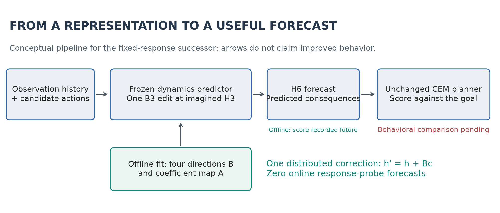
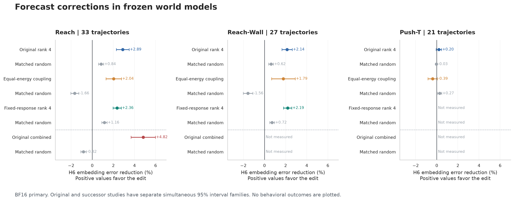
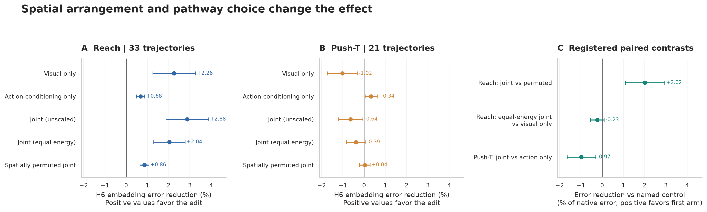
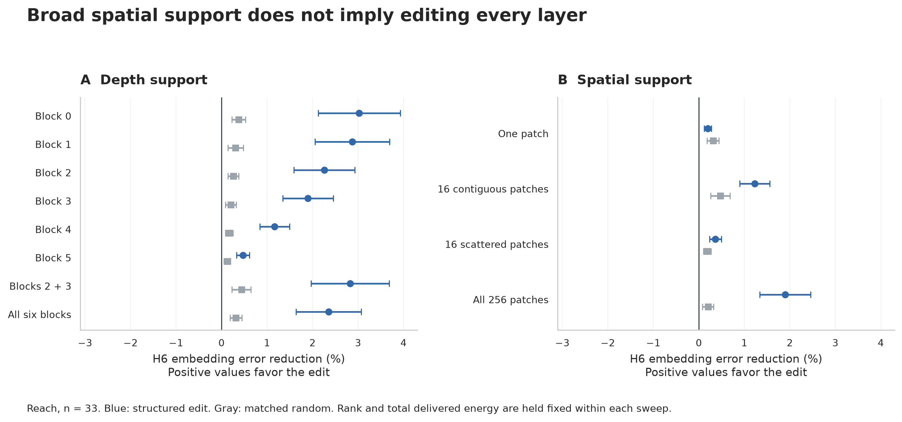
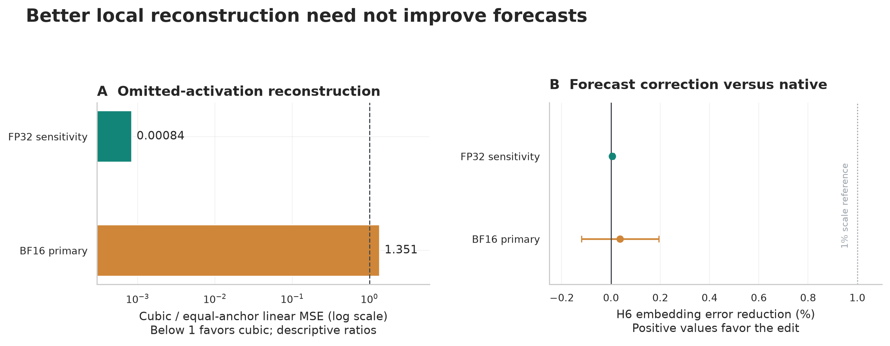
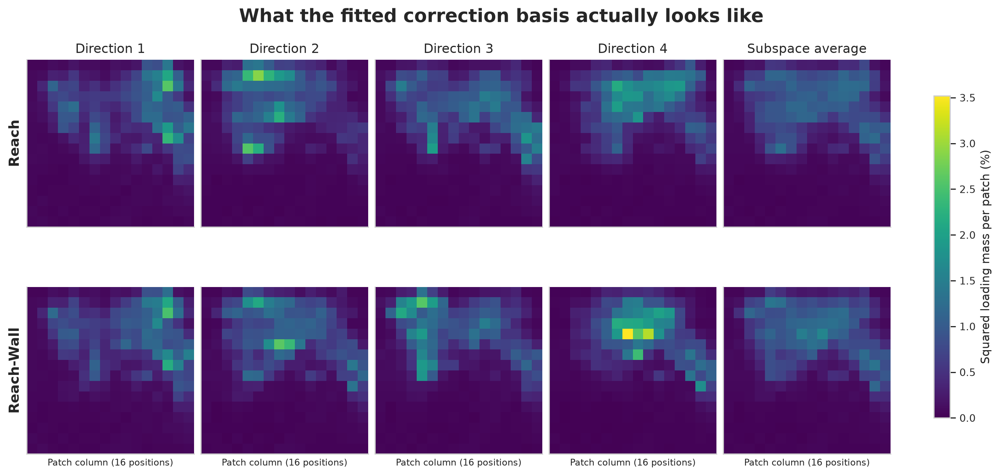

# Figure gallery

*Completed offline development evidence and existing fitted weights, September 8, 2026. No task-success outcomes are plotted. SVGs are editable; PNGs are previews.*

## fig01 intervention pipeline

Figure 1. Fixed-response intervention pipeline. The base model remains frozen. A map calibrated offline computes four coefficients from native H3 activations and applies one distributed edit at predictor block B3. Corrected offline forecasts are measured; the full behavioral comparison remains incomplete. This diagram is conceptual, not a measured rollout or proof of action-ranking improvement.

[PNG](figures/fig01_intervention_pipeline.png) · [Editable SVG](figures/fig01_intervention_pipeline.svg)

## fig02 forecast effects

Figure 2. Selected completed BF16 H6 proprioceptive embedding-MSE contrasts versus each study's paired native arm, alongside matched-random arms. Intervals are the source reports' paired-lineage simultaneous 95% intervals, scaled by the observed native mean. They are simultaneous within each task/category/precision, not globally across this figure. The original combined study (below dashed separator) and fixed-response successor have separate inference families. Missing methods are unmeasured, not zero. Estimates do not establish cross-study equivalence or a difference between old and new operators. These are forecast-error changes, not success-rate gains; 33/27/21 development trajectories are reused across arms.

[PNG](figures/fig02_forecast_effects.png) · [Editable SVG](figures/fig02_forecast_effects.svg)

## fig03 pathway and spatial controls

Figure 3. BF16 pathway decomposition and existing registered paired contrasts. Visual and action-conditioning edits have opposing effects on Push-T. Reach's joint edit outperforms its spatial permutation, while equal-energy joint steering does not establish superiority over visual-only steering. Unscaled joint has a different total energy from equal-energy joint. Panels A/B compare with native; panel C compares with its named control, always scaling differences by native error. Source simultaneous 95% intervals are reused without new tests. These interventions do not identify semantic variables or establish equal-energy synergy.

[PNG](figures/fig03_pathway_and_spatial_controls.png) · [Editable SVG](figures/fig03_pathway_and_spatial_controls.svg)

## fig04 distribution

Figure 4. Reach BF16 depth and spatial-support sweeps at fixed total rank 1 and matched delivered energy within each sweep, with source simultaneous 95% intervals. Depth varies B0-B5, B2+B3, or all six blocks while retaining all patches. Spatial support varies at the registered B3 site. Several singleton blocks help; only all-patch spatial support passed the frozen spatial gates. These are separate sweeps, not a crossed layer-by-position experiment. The result does not automatically identify the best site for the rank-4 successor.

[PNG](figures/fig04_distribution.png) · [Editable SVG](figures/fig04_distribution.svg)

## fig05 geometry boundary

Figure 5. Push-T (21 trajectories): two different endpoints. Left: ratios of group-weighted mean omitted-activation MSE; no uncertainty interval is inferred for these descriptive ratios. Cubic reconstruction is approximately 1,192 times better in FP32 but about 35% worse in BF16. Right: the dose-controlled cubic intervention's H6 proprioceptive embedding error reduction versus native, with source simultaneous 95% intervals. Both forecast intervals include zero. The 1% line is a scale reference, not a recomputed source eligibility boundary. The diagnostic reconstructs a local action-response curve; it does not test all manifold steering methods or establish a cubic physical law.

[PNG](figures/fig05_geometry_boundary.png) · [Editable SVG](figures/fig05_geometry_boundary.svg)

## fig06 fitted basis

Figure 6. Spatial squared loadings of the actual fixed-response rank-4 correction bases, extracted from checksum-verified fitting banks. Each direction contains 256 patches by 400 features. Color sums squared feature loadings within a patch; each panel sums to 100%. The fifth column averages the four unit-direction maps and is invariant to an orthogonal rotation of this subspace. Individual axes depend on the fitted basis; they are not named physical variables or aligned across tasks. These are fixed basis weights, not a per-example edit, attention map, saliency map, image segmentation, or a discovered physical manifold. Common color limits permit comparison without separately rescaling each map. Patch layout follows the model's 16-by-16 raster ordering. No additional model evaluations or fitting were performed.

[PNG](figures/fig06_fitted_basis.png) · [Editable SVG](figures/fig06_fitted_basis.svg)

## Data and interpretation

[All registered contrasts](data/reported_contrasts.csv) · [Provenance](data/figure_provenance.json) · [Statistical scope](appendix.md)
